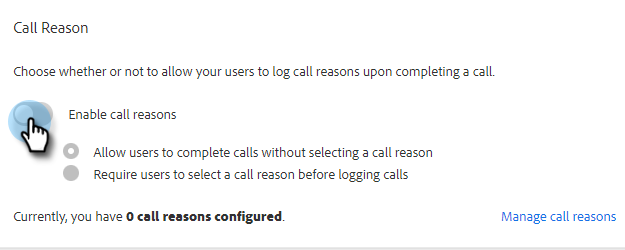

# Motivi della chiamata {#call-reasons}

Consenti ai team di vendita di selezionare i motivi delle chiamate durante le chiamate in modo che il tuo team possa capire perché vengono effettuate le chiamate.

>[!NOTE]
>
>**Autorizzazioni di amministrazione richieste.**

## Abilita motivi di chiamata {#enable-call-reasons}

1. Fai clic sull’icona a forma di ingranaggio e seleziona **Impostazioni**.

   

1. In Impostazioni amministratore, seleziona **Dialogo**.

   

1. Seleziona **Abilita motivi di chiamata**.

   

1. Scegli il requisito del motivo della chiamata desiderato.

   

## Crea motivo chiamata {#create-call}

1. Fai clic sull’icona a forma di ingranaggio e seleziona **Impostazioni**.

   

1. In Impostazioni amministratore, seleziona **Dialogo**.

   

1. Fai clic su **Gestire i motivi delle chiamate**.

   

1. Inserisci il nome del motivo della chiamata desiderato nel campo di testo e fai clic su **Aggiungi**.

   

## Selezionare un motivo di chiamata {#select-a-call-reason}

Una volta abilitati i motivi della chiamata. Gli utenti possono selezionarne uno durante una chiamata .

1. Fai clic sul pulsante di chiamata per avviare il dialer.

   PICC

1. Immetti le informazioni sulla chiamata nella finestra di dialogo.

   PICC

1. Fai clic su Chiama.

   PICC

1. Seleziona il motivo della chiamata che descrive meglio la chiamata.

   PICC

1. Termina la chiamata.

   PICC

1. Registra la chiamata.

   PICC

>[!MORELIKETHIS]
>
>* [Segnala i motivi delle chiamate e i risultati delle chiamate a Salesforce](/help/marketo/product-docs/marketo-sales-connect/phone/log-call-reasons-and-call-outcomes-to-salesforce.md)
>* [Risultati chiamata](/help/marketo/product-docs/marketo-sales-connect/phone/call-outcomes.md)

