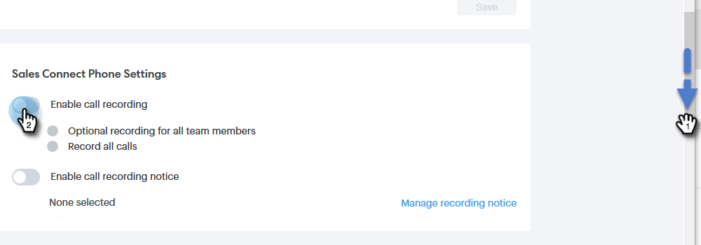

# Abilitare la registrazione delle chiamate {#enable-call-recording}

In qualità di amministratore, puoi abilitare la registrazione delle chiamate per le chiamate [!DNL Sales Connect]. Registrare le chiamate del tuo team può essere un ottimo modo per istruire i rappresentanti commerciali sulle migliori pratiche di chiamata.

1. Fare clic sull&#39;icona Impostazioni e selezionare **[!UICONTROL Settings]**.

   

1. In [!UICONTROL Admin Settings], fare clic su **[!UICONTROL General]**.

   

1. Scorri verso il basso fino a [!DNL Sales Connect] Impostazioni telefono e seleziona l&#39;interruttore **[!UICONTROL Enable call recording]**.

   

1. Se si desidera consentire ai venditori di attivare o disattivare la registrazione delle chiamate, fare clic su **[!UICONTROL Optional recording for all team members]**. Se si desidera registrare automaticamente tutte le chiamate, fare clic su **[!UICONTROL Record all calls]**.

   

>[!MORELIKETHIS]
>
>[Impostazioni di consenso di due parti](/help/marketo/product-docs/marketo-sales-connect/phone/two-party-consent-settings.md)
