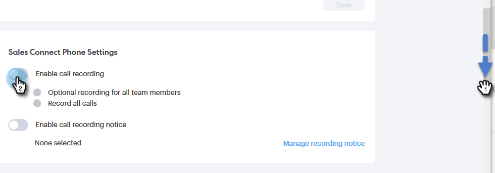

# Abilita registrazione chiamate {#enable-call-recording}

In qualità di amministratore puoi abilitare la registrazione delle chiamate per le chiamate Sales Connect. Registrare le chiamate del tuo team può essere un ottimo modo per istruire i rappresentanti commerciali sulle migliori pratiche di chiamata.

1. Fai clic sull’icona Impostazioni e seleziona **Impostazioni**.

   

1. In Impostazioni amministrazione, fai clic su **Generale**.

   

1. Scorri verso il basso fino a Impostazioni telefono Sales Connect e seleziona la **Abilita registrazione chiamate** attivare/disattivare.

   

1. Se desideri consentire ai venditori di abilitare o disabilitare la registrazione delle chiamate, fai clic su **Registrazione opzionale per tutti i membri del team**. Se si desidera registrare automaticamente tutte le chiamate, fare clic su **Registra tutte le chiamate**.

   

>[!MORELIKETHIS]
>
>[Impostazioni di consenso di due parti](/help/marketo/product-docs/marketo-sales-connect/phone/two-party-consent-settings.md)
