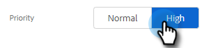

# Creare e assegnare attività promemoria {#create-and-assign-reminder-tasks}

Le attività di promemoria sono un ottimo modo per rimanere al passo con il coinvolgimento di clienti e potenziali clienti. Per creare un&#39;attività, eseguire la procedura seguente.

1. Fai clic su **[!UICONTROL Command Center]**.

   

1. Le attività vengono aperte per impostazione predefinita. Fai clic su **[!UICONTROL Add Task]**.

   

1. Selezionare il tipo di attività tra [!UICONTROL Email], [!UICONTROL Call], [!UICONTROL InMail] o [!UICONTROL Custom].

   

1. Assegna un nome all&#39;attività.

   

1. Scegliere se mantenere l&#39;attività assegnata a se stessi o selezionare un altro utente a cui assegnare l&#39;attività.

   

1. Aggiungi la persona con cui stai seguendo, con questa attività di promemoria.

   

1. Selezionare la data di scadenza dell&#39;attività.

   

1. Selezionare la priorità dell&#39;attività.

   

1. Aggiungere tutti i dettagli sull&#39;attività che si desidera rendere disponibili quando si completa l&#39;attività, ad esempio le note di conversazione telefonica, un modello di messaggio InMail o anche le note sulla persona. Al termine, fai clic su **[!UICONTROL Create]**.

   
