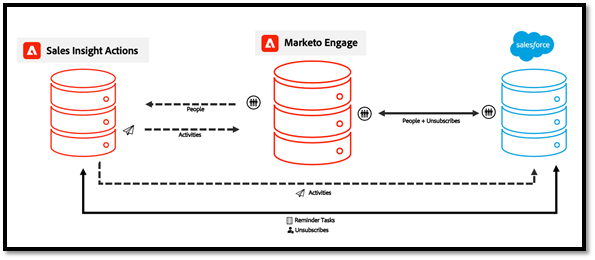
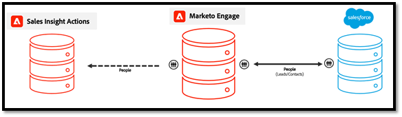

# Domande frequenti sulla sincronizzazione dei dati delle azioni {#actions-data-sync-faq}

La sincronizzazione del campo di unificazione dei dati per le azioni Approfondimenti vendite consente al sistema di estrarre le informazioni personali dal database del Marketo Engage nel database delle azioni Insight vendite.

Questo fornisce dati aggiornati sulle persone nell’app Web Sales Insight Actions e consente al sistema di raccogliere ID univoci per i record delle persone corrispondenti in Marketo e i record lead/contact/account/opportunità in Salesforce, in modo che i record possano essere correttamente referenziati per la registrazione dei dati.

Questa sincronizzazione può essere abilitata dalla scheda Configurazione azioni di Insight vendite nella sezione Amministrazione del Marketo Engage. Per ulteriori informazioni, consulta [Avvia sincronizzazione dati](/help/marketo/product-docs/marketo-sales-insight/actions/getting-started/sales-insight-actions-admin-setup-guide.md#initiate-data-sync).

Il diagramma precedente mostra come i dati delle attività e delle attività delle persone possono sincronizzarsi tra i sistemi. Alcuni aspetti da tenere presente:

* I record relativi alle persone vengono sincronizzati con le azioni Approfondimenti vendite dal Marketo Engage, rendendo il Marketo Engage la fonte di verità per i dati relativi alle azioni di Insight vendite
* Azioni di Insight su Marketo Engage e vendite [avere un meccanismo](/help/marketo/product-docs/marketo-sales-insight/actions/email/unsubscribes/syncing-unsubscribes-with-salesforce.md) per la raccolta e la sincronizzazione dello stato di annullamento dell’abbonamento a Salesforce
* Lo stato di annullamento dell’abbonamento non si sincronizza con il Marketo Engage con le azioni di vendita, ma è possibile configurare le azioni Approfondimenti vendite per controllare lo stato di annullamento dell’abbonamento Marketo delle persone prima di consentire ai venditori di inviare un’e-mail con [Controllo dell’annullamento dell’abbonamento a Marketo](/help/marketo/product-docs/marketo-sales-insight/actions/email/unsubscribes/marketo-unsubscribe-check.md).

Di seguito sono riportate alcune domande frequenti relative al funzionamento della sincronizzazione dell’unificazione dei dati.

## Quali lead/contatti vengono sincronizzati con le azioni Approfondimenti vendite? {#what-lead-contacts-are-synced}

I lead e i contatti a cui è stato assegnato un proprietario di vendita verranno sincronizzati in Azioni di vendita.

Puoi verificare se un lead/contatto ha un proprietario di vendite in Salesforce guardando il campo proprietario standard esistente.

Il proprietario della vendita non deve essere necessariamente l&#39;utente di sincronizzazione Marketo o qualsiasi utente di vendita o Salesforce specifico. È sufficiente che un utente sia elencato nel campo proprietario lead e proprietario del contatto elencato in Salesforce, in modo da identificarlo come lead di vendita e sincronizzarlo nelle azioni Approfondimenti vendite. Eventuali aggiornamenti ai campi con cui ci sincronizziamo verranno inoltre rilevati e aggiornati in Azioni Approfondimenti vendite.

## Da dove vengono estratti i dati dell&#39;attività visualizzati nella griglia intelligente di Insight vendite? {#where-does-the-activity-data-get-sourced-from}

I dati dell’attività, come e-mail, chiamata, momento interessante e web, provengono tutti dal database del Marketo Engage. La griglia intelligente di Insight vendite invia una richiesta all&#39;istanza di Marketo Engage per recuperarla ogni volta che un utente di vendita carica il pannello Insight vendite.

Per garantire che tutti i dati dell’attività possano essere originati dal Marketo Engage, le azioni Insight sulle vendite sincronizzano tutti i dati dell’attività al Marketo Engage.

## Quali campi relativi alla sincronizzazione dei record delle persone da Marketo Engage a azione Approfondimenti vendite? {#what-fields-sync}

Ci sono 11 campi che si sincronizzano da Marketo Engage a azione Approfondimenti vendite:

* Nome
* Cognome
* ID contatto Salesforce
* ID lead Salesforce
* ID Marketo
* Azienda
* Titolo
* E-mail
* Numero di telefono
* URL Linkedin
* Fonte

## È possibile configurare i campi che eseguono la sincronizzazione tra le azioni di Marketi Engage e Insight vendite? {#are-the-fields-that-sync-configurable}

La configurazione della sincronizzazione dei campi del Marketo Engage con le azioni Approfondimenti vendite non è disponibile, né la possibilità di mappare i campi. La sincronizzazione da Marketo associa automaticamente i campi Marketo standard ai campi standard nell’istanza Azione di vendita.

## Perché le azioni di Insight sulle vendite hanno un proprio database? {#why-does-actions-have-its-own-database}

Le azioni di Insight sulle vendite dispongono di una propria applicazione web con una persona e un database di attività dedicati per fornire un&#39;area di lavoro ottimizzata creata e progettata per i team di vendita. Questo consente ai sales manager e ai venditori di avere uno spazio per sviluppare e gestire la loro strategia di coinvolgimento senza concedere l&#39;accesso o i privilegi all&#39;area di lavoro del Marketo Engage primario, ottimizzata per gli specialisti di operazioni di marketing.

## Come vengono gestiti i duplicati? {#how-are-duplicates-handled}

Il database delle azioni di vendita sarà una copia delle persone qualificate (lead/contatti con un proprietario di vendite) presenti nel database del Marketo Engage. Ciò significa che se ci sono due record con lo stesso indirizzo e-mail creato in Marketo, ci sarà un record duplicato creato in Azioni di vendita.

## Quanto tempo è necessario per il completamento della sincronizzazione iniziale? {#how-long-initial-sync}

Il processo iniziale per la sincronizzazione di tutti i dati dei lead di vendita in una nuova istanza delle azioni Approfondimenti vendite in genere elabora le persone a circa 1.000 ogni 1-2 minuti. Questo è solo un preventivo e può variare.

Una volta effettuata la sincronizzazione iniziale e tutti i lead di vendita sono stati compilati nell’istanza dell’app Web Sales Insight Actions, vi sarà una sincronizzazione incrementale che verrà eseguita ogni volta che si verifica un aggiornamento a uno dei campi supportati sincronizzati.

## Gli utenti di Sales Insight Actions possono modificare i dati delle persone dall&#39;app web Actions? {#can-actions-users-edit-people-data}

No, la possibilità di creare e modificare record relativi alle persone in Azioni non è disponibile sia per gli utenti che per gli amministratori dell’app Web Actions. La creazione e la modifica delle persone devono essere eseguite in Salesforce o nel Marketo Engage. Le azioni Insight sulle vendite utilizzano Marketo come fonte di verità per i dati relativi alle persone sincronizzando continuamente i nuovi dati, quindi se una persona viene aggiornata o creata in Marketo da un flusso di lavoro in Marketo o sincronizzata da Salesforce, tali aggiornamenti verranno passati al database delle app web app di Insight sulle vendite.

## Le attività di vendita accedono a Marketo? {#do-sales-activities-log-to-marketo}

Sì, le attività di coinvolgimento nelle vendite effettueranno l’accesso a Marketo come attività native. Queste attività includono anche filtri nativi che possono essere utilizzati con vincoli per eseguire il targeting dei lead in base agli attributi delle attività di vendita.

Di seguito è riportato un elenco delle attività che effettuano l’accesso a Marketo:

* Invia e-mail di vendita
* Apri e-mail di vendita
* Fai clic su E-mail di vendita
* Risposta all&#39;e-mail di vendita
* E-mail di vendita rimbalzata
* Chiamata di vendita ricevuta
* Aggiungi alla campagna di vendita
* Rimosso dalla campagna di vendita

## Le attività di vendita accedono a Salesforce? {#do-sales-activities-log-to-salesforce}

Sì, le attività di impegno di vendita effettueranno l’accesso a Salesforce come attività native. Queste attività possono quindi essere utilizzate nei rapporti Salesforce per abilitare dashboard del team che tengono traccia delle attività di vendita.

Le azioni Approfondimenti vendite consentono agli amministratori di configurare quali attività di vendita sono registrate su Salesforce. Queste attività includono e-mail, chiamate e attività di promemoria aperti.

Il diagramma qui sopra mostra quali informazioni sono registrate su Salesforce. Attività come e-mail e chiamate vengono registrate su Salesforce in un [sincronizzazione unidirezionale](/help/marketo/product-docs/marketo-sales-insight/actions/crm/salesforce-integration/salesforce-sync-settings.md). [Annulla sottoscrizione](/help/marketo/product-docs/marketo-sales-insight/actions/email/unsubscribes/syncing-unsubscribes-with-salesforce.md) e [Attività promemoria](/help/marketo/product-docs/marketo-sales-insight/actions/tasks/reminder-task-sync-with-salesforce.md) sono costantemente aggiornate con una sincronizzazione bidirezionale. Ognuna di queste sincronizzazioni di dati è configurabile dall&#39;interfaccia dell&#39;app Web Sales Insight Actions.

>[!MORELIKETHIS]
>
>* [Sincronizzazione degli abbonamenti con Salesforce](/help/marketo/product-docs/marketo-sales-insight/actions/email/unsubscribes/syncing-unsubscribes-with-salesforce.md)
>* [Controllo dell’annullamento dell’abbonamento a Marketo](/help/marketo/product-docs/marketo-sales-insight/actions/email/unsubscribes/marketo-unsubscribe-check.md)
>* [Impostazioni di sincronizzazione Salesforce](/help/marketo/product-docs/marketo-sales-insight/actions/crm/salesforce-integration/salesforce-sync-settings.md)
>* [Sincronizzazione attività promemoria con Salesforce](/help/marketo/product-docs/marketo-sales-insight/actions/tasks/reminder-task-sync-with-salesforce.md)
>* [Avvia sincronizzazione dati](/help/marketo/product-docs/marketo-sales-insight/actions/getting-started/sales-insight-actions-admin-setup-guide.md#initiate-data-sync)

