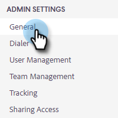

# Blocco del contenuto {#content-lockdown}

Attivando il blocco dei contenuti, gli utenti non amministratori non possono modificare modelli e/o campagne. Gli utenti non potranno: condividere, clonare, modificare o eliminare contenuti. Inoltre, non avranno la possibilità di archiviare i modelli.

>[!NOTE]
>
>Gli utenti potranno comunque modificare il contenuto di un’e-mail al momento dell’invio o all’avvio di una campagna.

1. Fai clic sull’icona a forma di ingranaggio e seleziona **Impostazioni**.

   

1. In Impostazioni amministratore, fai clic su **Generale**.

   

1. Scorri verso il basso fino a Blocco del contenuto. Attivando uno dei due dispositivi di scorrimento, i membri del team non saranno in grado di creare/modificare modelli e/o campagne.

   
