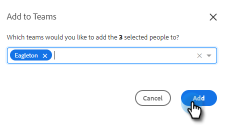

# Creazione di un team {#creating-a-team}

La creazione di un team ti consente di assemblare un gruppo di utenti con cui è possibile condividere il contenuto e filtrare i rapporti in base a .

## Crea un team {#create-a-team}

1. In [applicazione web](https://toutapp.com/login), fai clic sull’icona a forma di ingranaggio e seleziona **Impostazioni**.

   

1. In Impostazioni amministratore, seleziona **Gestione team**.

   

1. Accanto a Team, fai clic su **+** icona.

   

1. Immetti un nome per il team e fai clic su **Crea**.

   

>[!NOTE]
>
>Ora puoi condividere modelli, campagne e gruppi con quel team.

## Aggiungi persone a un team {#add-people-to-a-team}

1. Sempre in Gestione team, selezionare **Tutti i membri**.

   

1. Individua gli utenti da aggiungere al team e seleziona la relativa casella di controllo.

   

1. Fai clic su **Aggiungi ai team**.

   

1. Fai clic sull’elenco a discesa e seleziona il team desiderato.

   

1. Fai clic su **Aggiungi** al termine.

   
