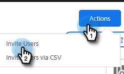

# Invitare utenti e amministratori {#invite-users-and-admins}

Aggiungere utenti o amministratori è facile e veloce.

## Invitare gli utenti {#invite-users}

1. Fare clic sull&#39;icona ingranaggio e selezionare **[!UICONTROL Settings]**.

   

1. In [!UICONTROL Admin Settings], selezionare **[!UICONTROL User Management]**.

   

1. Fare clic sul pulsante **[!UICONTROL Actions]** e selezionare **[!UICONTROL Invite Users]**.

   

   >[!NOTE]
   >
   >Puoi anche selezionare **[!UICONTROL Invite Users via CSV]** se li hai elencati tutti in un foglio di calcolo.

1. Inserisci gli indirizzi e-mail dei singoli utenti che desideri aggiungere.

   

1. PASSAGGIO FACOLTATIVO: aggiungere gli utenti a tutti i team di cui dovrebbero far parte. Se salti questa parte, tutti i nuovi membri verranno aggiunti al team Everyone.

   

   >[!NOTE]
   >
   >[Ulteriori informazioni sui team](/help/marketo/product-docs/marketo-sales-insight/actions/admin/creating-a-team.md).

1. Selezionare l&#39;area di lavoro di Marketo a cui si desidera aggiungere i nuovi utenti. Se disponi di una sola area di lavoro, come opzione visualizzerai &quot;Predefinito&quot;. Fai clic su **Invita**.

   

1. Fai clic su **[!UICONTROL OK]**.

   

## Rendere un utente amministratore {#make-a-user-an-admin}

>[!NOTE]
>
>**Autorizzazioni amministratore richieste**

Segui questi passaggi per rendere amministratore un utente esistente.

1. Fare clic sull&#39;icona ingranaggio e selezionare **[!UICONTROL Settings]**.

   

1. In [!UICONTROL Admin Settings], selezionare **[!UICONTROL User Management]**.

   

1. Individuare l&#39;utente che si desidera impostare come amministratore, fare clic sull&#39;elenco a discesa Ruolo e selezionare **[!UICONTROL Admin]**.

   

Semplice come quella!
