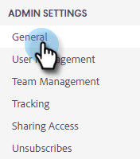

# Impostazioni di Gestione accessi {#login-management-settings}

Le impostazioni di Gestione accessi consentono agli amministratori di impostare le preferenze di autenticazione per gli utenti delle azioni Approfondimenti vendite a livello globale.

>[!NOTE]
>
>Per impostazione predefinita, l’opzione Solo Salesforce sarà selezionata per le istanze Azioni Insight vendite. Consigliamo questa impostazione in modo che gli utenti possano [accesso automatico](/help/marketo/product-docs/marketo-sales-insight/actions/admin/auto-login-from-salesforce.md) da Salesforce.

## Aggiorna impostazioni di gestione accessi {#update-login-management-settings}

>[!NOTE]
>
>**Autorizzazioni amministratore richieste**

Aggiorna le preferenze di gestione dell&#39;accesso e segui questi passaggi.

1. Fai clic sull’icona a forma di ingranaggio e seleziona **Impostazioni**.

   

1. In Impostazioni amministratore, fai clic su **Generale**.

   

1. Scorri verso il basso fino alla scheda Login Management e seleziona l&#39;impostazione desiderata (in questo esempio scegliamo solo Salesforce). Fai clic su **Salva** al termine.

   

## Domande frequenti solo su Salesforce {#salesforce-only-faq}

Solo Salesforce indica che gli utenti possono eseguire l’autenticazione solo per utilizzare le azioni Approfondimenti vendite con Salesforce. È la selezione predefinita per le istanze di Sales Insight Actions ed è consigliata per la sua capacità di consentire agli utenti di eseguire l’autenticazione senza problemi senza dover gestire un nome utente e una password.

### In che modo un nuovo utente della mia istanza attiva il proprio account quando viene selezionato &quot;Solo Salesforce&quot;? {#activate-when-salesforce-only-is-selected}

Facendo clic sul pulsante **Introduzione** nell’e-mail di invito, i nuovi utenti verranno inviati a una schermata di attivazione dell’account in cui dovranno collegare la propria istanza Salesforce per attivare il proprio account Azioni Insight vendite.

### Con quali metodi di autenticazione i miei utenti possono effettuare l’autenticazione quando viene selezionato &quot;Solo Salesforce&quot;? {#what-authentication-methods}

Quando si passa alla schermata di accesso, gli utenti inseriranno prima il loro indirizzo e-mail. Poi cliccano sul pulsante di accesso Salesforce One Click, dove possono eseguire l&#39;autenticazione utilizzando l&#39;account Salesforce a cui hanno effettuato l&#39;accesso.

>[!NOTE]
>
>Questo riguarda solo gli utenti che accedono direttamente alla schermata di accesso. Gli utenti che accedono alle azioni da Salesforce avranno effettuato l’accesso con [Accesso automatico](/help/marketo/product-docs/marketo-sales-insight/actions/admin/auto-login-from-salesforce.md).

### Come viene gestita l’autenticazione utente per le azioni quando un utente accede a una funzione Azioni da Salesforce e viene selezionato &quot;Solo Salesforce&quot;? {#how-is-user-authentication-handled}

Quando un utente fa clic su una delle azioni (chiamata, e-mail, campagna, attività, elenco campagne, ecc.), utilizziamo la loro autenticazione SFDC per accedere automaticamente al loro account Azioni Insight vendite. Chiamiamo questa autenticazione [Accesso automatico](/help/marketo/product-docs/marketo-sales-insight/actions/admin/auto-login-from-salesforce.md).

## Domande frequenti su tutti i metodi di accesso {#all-login-methods-faq}

### In che modo un nuovo utente della mia istanza attiva il proprio account quando viene selezionato &quot;Tutti i metodi di login&quot;? {#activate-when-all-login-methods-is-selected}

Quando un nuovo utente viene invitato in un&#39;istanza, riceverà un&#39;e-mail di attivazione dell&#39;account. Cliccheranno sul pulsante &quot;Introduzione&quot; che li porterà in una pagina in cui viene richiesto di creare e confermare una password. Una volta creato, il loro account verrà attivato e verrà utilizzato attraverso il flusso di lavoro di onboarding.

### Con quali utenti della mia istanza è consentito effettuare l’accesso quando è selezionato &quot;Tutti i metodi di accesso&quot;? {#what-are-users-allowed-to-log-in-with-all-login}

Quando utilizziamo la nostra pagina di accesso, gli utenti inseriranno prima il loro indirizzo e-mail. Poi verranno inviati a una pagina che dà loro tutte le opzioni di accesso (nome utente/password, SFDC, Gmail, SSO) con cui eseguire l&#39;autenticazione.
