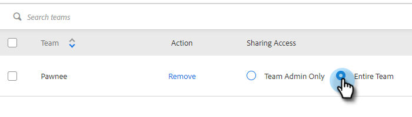

# Impostazioni di condivisione {#sharing-settings}

Gestisci meglio i modelli limitando gli elementi condivisibili dagli utenti e le categorie con cui possono essere condivisi.

Quando l&#39;account di vendita Connect viene creato per la prima volta, le impostazioni di condivisione vengono abilitate. Questo offre agli amministratori dell’account l’opportunità di creare e organizzare le categorie di modelli prima di aprire i gateway e consentire agli utenti di condividere i contenuti nelle categorie del team.

Quando le Impostazioni di condivisione sono abilitate, solo gli amministratori possono condividerle in categorie a meno che non siano forniti privilegi di condivisione a un team o a tutti. Se le impostazioni di condivisione sono disattivate, non vi sono restrizioni e tutti gli utenti possono condividerle in qualsiasi categoria di modelli.

## Configurare le impostazioni di condivisione {#configure-your-sharing-settings}

1. In [applicazione web](https://toutapp.com/login), fai clic sull’icona a forma di ingranaggio e seleziona **Impostazioni**.

   

1. In Impostazioni amministratore, seleziona **Accesso condiviso**.

   

1. Assicurati **Impostazioni di condivisione** è abilitato. Questo significa che per impostazione predefinita solo gli amministratori possono condividere i modelli nelle categorie di modelli.

   

1. Seleziona la categoria di modelli da configurare.

   

1. Fai clic su **Aggiungi team per l&#39;accesso**.

   

1. Seleziona i team da aggiungere.

   

   >[!NOTE]
   >
   >Se non trovi team, devi passare a Gestione team e creare un team di utenti.

1. Fai clic su **Aggiungi team per l&#39;accesso** da salvare.

   

1. Dopo l’aggiunta del team, puoi selezionare per consentire solo agli amministratori del team di condividere o a tutti gli utenti del team. In questo esempio diamo a tutti gli utenti del team SDR l&#39;accesso condiviso.

   
