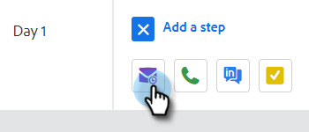

# Creare una campagna di vendita {#create-a-sales-campaign}

Le campagne di vendita sono una serie di passaggi multicanale, tra cui e-mail, telefonate, InMail e attività personalizzate. Consentono di semplificare le comunicazioni con i clienti potenziali e quelli esistenti.

Con le campagne di vendita è possibile:

* **Organizza**: semplifica tutte le attività di outreach in un&#39;unica posizione per un&#39;esecuzione efficiente.
* **Scala**: pianifica tutte le tue attività di sensibilizzazione in modo da poter ridimensionare le tue attività, ridurre al minimo il lavoro manuale e personalizzare tutto il necessario.
* **Misura**: tieni traccia del completamento di tutte le e-mail e le attività in un&#39;unica posizione, registrandole automaticamente in [!DNL Salesforce]. Conoscendo ciò che risuona e porta ai risultati, puoi testare e migliorare costantemente i risultati.

Quindi, come si imposta una campagna di vendita?

1. Fare clic sulla scheda **[!UICONTROL Campaigns]**.

   

1. Selezionare una categoria e fare clic sul pulsante **[!UICONTROL Create New Campaign]**.

   

   >[!NOTE]
   >
   >Creare una nuova categoria facendo clic su **+** accanto a **[!UICONTROL Categories]**.

1. Verrà selezionata la categoria selezionata. Se cambi idea, fai clic sul menu a discesa e selezionane uno diverso. Al termine, fare clic su **[!UICONTROL Continue]**.

   

1. Fai clic su **[!UICONTROL Add a Step]**.

   

1. Scegli tra: E-mail, Chiamata, InMail o Attività personalizzata. In questo esempio scegliamo E-mail.

   

1. Al [completamento dell&#39;e-mail](/help/marketo/product-docs/marketo-sales-insight/actions/campaigns/sales-campaign-step-types-and-reminder-tasks.md#email){target="_blank"}, fai clic su **[!UICONTROL Add]**.

   

1. Dopo aver creato il primo giorno e il primo passaggio, il pulsante &quot;[!UICONTROL Add a Day]&quot; si attiva e puoi aggiungere tutti i giorni e i passaggi necessari per il processo di vendita.

   

   >[!NOTE]
   >
   >&quot;Giorni&quot; non è il numero di giorni tra le azioni, ma il giorno all’interno della sequenza. Ad esempio, se la campagna di vendita durerà 7 giorni, l&#39;immissione di &#39;3&#39; indica che l&#39;azione si interromperà il giorno 3 di 7, **not** 3 giorni dopo.

1. Assicurati di personalizzare le opzioni di pianificazione e risposta, ad esempio saltare i fine settimana (fantastico) visitando la scheda **[!UICONTROL Settings]** per la tua campagna di vendita.

   

Ora è il momento di iniziare ad aggiungere persone!

>[!MORELIKETHIS]
>
>* [Tipi di passaggi della campagna di vendita e attività promemoria](/help/marketo/product-docs/marketo-sales-insight/actions/campaigns/sales-campaign-step-types-and-reminder-tasks.md){target="_blank"}
>* [Impostazioni campagna vendite](/help/marketo/product-docs/marketo-sales-insight/actions/campaigns/sales-campaign-settings.md){target="_blank"}
