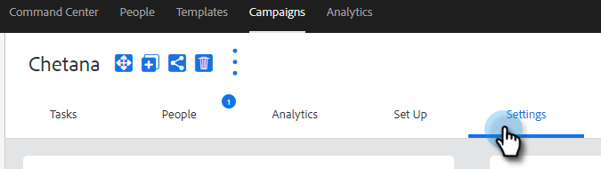

# Impostazioni della campagna di vendita {#sales-campaign-settings}

La sezione delle impostazioni della campagna di vendita ti consente di configurare una campagna di vendita specifica in modo che possa funzionare al meglio per i casi d’uso del tuo team per quella campagna.

## Ignora fine settimana {#skip-weekends}

Abilita salta i fine settimana in modo che tutti i passaggi che sarebbero caduti in un giorno weekend (sabato o domenica) verranno spostati a lunedì.

>[!NOTE]
>
>Se l’opzione Ignora fine settimana è abilitata, le e-mail verranno pianificate in base a una settimana di 5 giorni. Ciò significa che, quando un passaggio è pianificato, i fine settimana verranno ignorati come giorni.

1. Fai clic su **Campagne**.

   

1. Scegli la campagna desiderata.

   

1. Fai clic sul pulsante **Impostazioni** scheda .

   

1. Seleziona la **Ignora fine settimana** casella di controllo.

   

## Rimuovi in rimbalzo {#remove-on-bounce}

Se utilizzi la connessione e-mail, verranno rilevati i messaggi non recapitati in base al messaggio non recapitato inviato alla casella in entrata degli utenti. Inoltre, è possibile rimuovere le persone dalle campagne quando viene rilevato un messaggio non recapitato.

1. Fai clic su **Campagne**.

   

1. Scegli la campagna desiderata.

   

1. Fai clic sul pulsante **Impostazioni** scheda .

   

1. Seleziona la **Rimuovi in rimbalzo** casella di controllo.

   

## Se si verifica una risposta {#if-a-reply-occurs}

Se per Gmail o Exchange è abilitato il tracciamento delle risposte, è possibile terminare automaticamente la campagna vendite se un destinatario risponde al messaggio e-mail.

1. Fai clic su **Campagne**.

   

1. Scegli la campagna desiderata.

   

1. Fai clic sul pulsante **Impostazioni** scheda .

   

1. Sotto **Se si verifica una risposta**, effettua le selezioni desiderate.

   

>[!MORELIKETHIS]
>
>* [Creare una campagna di vendita](/help/marketo/product-docs/marketo-sales-insight/actions/campaigns/create-a-sales-campaign.md){target=&quot;_blank&quot;}
>* [Informazioni sulle opzioni di invio delle campagne di vendita per i passaggi e-mail](/help/marketo/product-docs/marketo-sales-insight/actions/campaigns/understanding-sales-campaign-send-options-for-email-steps.md){target=&quot;_blank&quot;}
>* [Tipi di passaggi della campagna di vendita e attività promemoria](/help/marketo/product-docs/marketo-sales-insight/actions/campaigns/sales-campaign-step-types-and-reminder-tasks.md){target=&quot;_blank&quot;}

