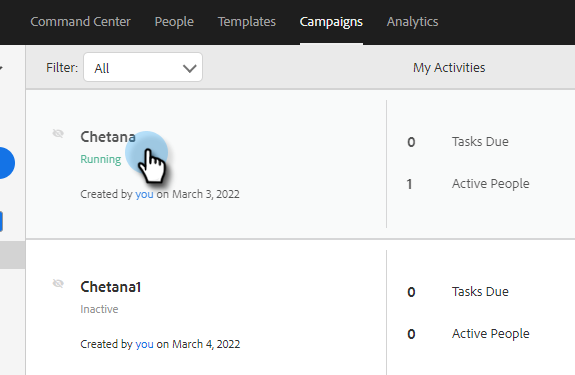

# Impostazioni campagna di vendita {#sales-campaign-settings}

La sezione Impostazioni campagna di vendita consente di configurare una campagna di vendita specifica in modo che possa funzionare nel modo migliore per i casi d’uso del team per quella campagna di vendita.

## Salta fine settimana {#skip-weekends}

Abilita Ignora fine settimana in modo che tutti i passaggi che sarebbero caduti in un giorno del weekend (sabato o domenica) vengano spostati a lunedì.

>[!NOTE]
>
>Con Salta fine settimana abilitato, le e-mail verranno pianificate in base a una settimana di 5 giorni. Ciò significa che, quando un passaggio è pianificato, i fine settimana verranno ignorati come giorni.

1. Clic **Campagne**.

   

1. Scegli la campagna di vendita desiderata.

   

1. Fai clic su **Impostazioni** scheda.

   

1. Seleziona la **Salta fine settimana** casella di controllo.

   

## Rimuovi in caso di mancato recapito {#remove-on-bounce}

Se utilizzi la connessione e-mail, verranno rilevati i messaggi non recapitati in base al messaggio non recapitato inviato alla casella in entrata degli utenti. Inoltre, possiamo rimuovere le persone dalle campagne di vendita quando viene rilevato un mancato recapito.

1. Clic **Campagne**.

   

1. Scegli la campagna di vendita desiderata.

   

1. Fai clic su **Impostazioni** scheda.

   

1. Seleziona la **Rimuovi in caso di mancato recapito** casella di controllo.

   

## Se si verifica una risposta {#if-a-reply-occurs}

Se hai abilitato il tracciamento delle risposte per Gmail o Exchange, possiamo terminare automaticamente la tua campagna di vendita se un destinatario risponde alla tua e-mail.

1. Clic **Campagne**.

   

1. Scegli la campagna di vendita desiderata.

   

1. Fai clic su **Impostazioni** scheda.

   

1. Sotto **Se si verifica una risposta**, effettuare le selezioni desiderate.

   

>[!MORELIKETHIS]
>
>* [Creare una campagna di vendita](/help/marketo/product-docs/marketo-sales-insight/actions/campaigns/create-a-sales-campaign.md){target="_blank"}
>* [Informazioni sulle opzioni di invio della campagna di vendita per i passaggi dell’e-mail](/help/marketo/product-docs/marketo-sales-insight/actions/campaigns/understanding-sales-campaign-send-options-for-email-steps.md){target="_blank"}
>* [Tipi di fasi della campagna di vendita e task promemoria](/help/marketo/product-docs/marketo-sales-insight/actions/campaigns/sales-campaign-step-types-and-reminder-tasks.md){target="_blank"}
