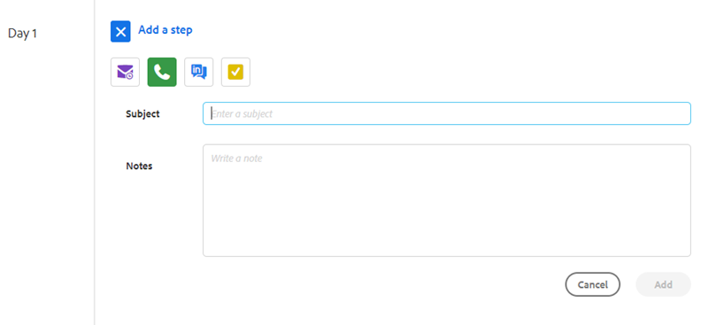

# Tipi di fasi della campagna di vendita e task promemoria {#sales-campaign-step-types-and-reminder-tasks}

## Tipi di fasi della campagna di vendita {#sales-campaign-step-types}

Quando aggiungi un passaggio alla tua campagna di vendita, hai quattro opzioni.

### E-mail {#email}

Componi una nuova e-mail o utilizza un modello preesistente.

| **Usa un modello** | Seleziona uno dei modelli preesistenti |
|---|---|
| **Salva come modello** | Salva l’e-mail appena composta come nuovo modello |
| **Aggiungi contenuto** | Carica un file sul nostro server e ricevi un URL (che punta al contenuto) che può essere tracciato nella tua e-mail |
| **Allega file** | Allega un file dal computer all’e-mail (limite di 23 MB) |

>[!TIP]
>
>Scopri i dettagli del tuo [opzioni di invio](/help/marketo/product-docs/marketo-sales-insight/actions/campaigns/understanding-sales-campaign-send-options-for-email-steps.md){target="_blank"}.

### Chiamata {#call}

Imposta un promemoria per il follow-up con un contatto telefonico. È inoltre possibile salvare le note da utilizzare come traccia di conversazione durante la chiamata.

### InMail {#inmail}

Il follow-up su più canali è un ottimo modo per connettersi con i lead. Con le attività InMail, puoi impostare un promemoria da inviare tramite LinkedIn.

### Attività personalizzata {#custom-task}

Utilizza le attività personalizzate quando le opzioni di cui sopra non sono applicabili. Ad esempio, puoi invitare un collega a seguire un lead tramite e-mail.

## Utilizzo delle attività promemoria nelle campagne di vendita {#using-reminder-tasks-in-sales-campaigns}

Le attività sono uno strumento potente quando si invia una campagna di vendita a un contatto, soprattutto se il processo di vendita è multicanale/touch.

Le attività per l&#39;invio di un&#39;e-mail e le attività per la chiamata di un contatto sono gli utilizzi più comuni per le attività nelle campagne di vendita.

Puoi anche impostare un &quot;Attività in Inmail&quot; come contatto in LinkedIn, se questo fa parte del flusso di lavoro. Puoi anche creare un&#39;attività personalizzata per ricordarti di invitarli ad un happy hour, chiedere informazioni sul loro evento di beneficenza, o check-in dopo il gioco 5, ecc.

>[!NOTE]
>
>La cosa più importante sulle Attività nelle campagne di vendita, è che devi completare l&#39;attività per attivare il passaggio successivo.

>[!MORELIKETHIS]
>
>[Creare una campagna di vendita](/help/marketo/product-docs/marketo-sales-insight/actions/campaigns/create-a-sales-campaign.md){target="_blank"}
