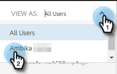

# Visualizza elenco campagne come un altro utente {#view-campaigns-list-as-another-user}

In qualità di amministratore, puoi visualizzare le campagne come qualsiasi utente.

>[!NOTE]
>
>**Autorizzazioni amministratore richieste**

1. Nell&#39;applicazione Web, fai clic su **Campagne**.

   

1. Fai clic sul pulsante **Visualizza come** e seleziona l’utente desiderato.

   

1. Le campagne vengono ora visualizzate come utente selezionato.

   

   >[!NOTE]
   >
   >Puoi anche utilizzare i filtri o la funzione di ricerca insieme a Visualizza come per visualizzare ciò che ti interessa di più.
