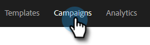
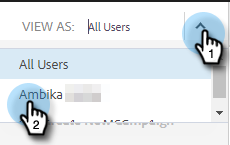

# Visualizzare un elenco di campagne come altro utente {#view-campaigns-list-as-another-user}

In qualità di Amministratore, puoi visualizzare le campagne come qualsiasi utente.

>[!NOTE]
>
>**Autorizzazioni amministratore richieste**

1. Nell&#39;applicazione Web fare clic su **[!UICONTROL Campaigns]**.

   

1. Fare clic sul menu a discesa **[!UICONTROL View As]** e selezionare l&#39;utente desiderato.

   

1. Stai visualizzando le campagne come utente selezionato.

   

   >[!NOTE]
   >
   >Puoi anche utilizzare i filtri o la funzione di ricerca insieme a [!UICONTROL View As] per visualizzare ciò che ti interessa di più.
