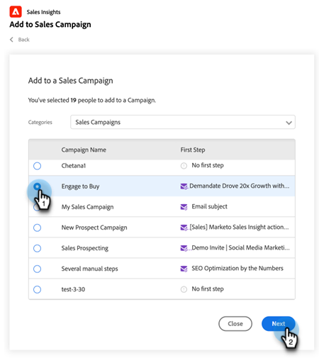

# Utilizzo di Bulk Add to Sales Campaign in Salesforce {#using-bulk-add-to-sales-campaign-in-salesforce}

Scopri come aggiungere in blocco campagne di vendita in Salesforce per ridimensionare le comunicazioni in uscita utilizzando le azioni di vendita.

>[!NOTE]
>
>Salesforce applica un limite di 200 record che possono essere selezionati contemporaneamente.

>[!PREREQUISITES]
>
>Assicurati di aver installato il [pacchetto Sales Insight più recente](/help/marketo/product-docs/marketo-sales-insight/msi-for-salesforce/upgrading/upgrading-your-msi-package.md){target="_blank"} nella tua istanza Salesforce e di aver configurato i [pulsanti di azione](/help/marketo/product-docs/marketo-sales-insight/actions/crm/salesforce-package-configuration/add-action-buttons-to-salesforce-list-view.md){target="_blank"} nelle visualizzazioni dei contatti e dell&#39;elenco di lead in Salesforce.

## Aggiunta in blocco alla campagna di vendita in Salesforce Lightning {#bulk-add-to-sales-campaign-in-salesforce-lightning}

1. In Salesforce, passare alla home page di lead/contatti facendo clic sulla scheda **lead/contatti**.

   

1. Nel menu a discesa **Visualizza**, seleziona la visualizzazione desiderata di lead/contatti che desideri inviare tramite e-mail.

   >[!TIP]
   >
   >Per creare una nuova visualizzazione, fai clic sull&#39;icona del baricentro a destra e seleziona **Nuovo**. Dopo aver assegnato alla visualizzazione un nuovo nome e averla salvata, puoi fare clic sull’icona del filtro a destra per passare al set desiderato di lead/contatti da inviare tramite e-mail.

1. Scegliere l&#39;elenco contatti o lead desiderato e fare clic sul pulsante **Aggiungi a campagna vendite**.

   

1. Passerai alla finestra modale Azioni campagna vendite, con i destinatari selezionati aggiunti.

1. Apportare le modifiche necessarie per rimuovere persone o gruppi, quindi fare clic su **Avanti**.

   

1. Selezionare la categoria della campagna di vendita che si desidera utilizzare dal menu a discesa Categorie.

1. Selezionare la campagna di vendita a cui si desidera aggiungere le persone selezionate e fare clic su **Avanti**.

   

1. Puoi visualizzare opzioni diverse a seconda del primo passaggio della campagna. Se il primo passaggio è un’e-mail, avrai la possibilità di modificare l’e-mail per ciascun destinatario come mostrato di seguito. Al termine, fai clic su **Avanti**.

   

1. Anche in questo caso, se il primo passaggio è un&#39;e-mail e l&#39;hai configurato per consentirti di selezionare quando verrà avviata la campagna, avrai la possibilità di **Iniziare ora** o **Pianificare una nuova ora di inizio**. Al termine, fare clic su **Inizio**.

   

Dopo aver fatto clic su Start, viene visualizzata una schermata di conferma che consente di sapere quante persone sono state aggiunte.

## Aggiunta in blocco alla campagna di vendita in Salesforce Classic {#bulk-add-to-sales-campaign-in-salesforce-classic}

1. In Salesforce, fai clic sulla scheda **Lead/Contatti**.

1. Nel menu a discesa Visualizza, selezionare la visualizzazione desiderata di Lead/Contatti che si desidera inviare tramite e-mail e fare clic su **Vai**.

   

   >[!TIP]
   >
   >Per creare una nuova visualizzazione, fai clic su Crea nuova visualizzazione e configura i filtri disponibili per restringere l’elenco dei destinatari da inviare tramite e-mail.

1. Scegliere l&#39;elenco contatti o lead desiderato e fare clic sul pulsante **Aggiungi a campagna vendite**.

   

1. Verrà visualizzata la finestra modale Azioni campagna vendite con le persone selezionate aggiunte.

1. Apportare le modifiche necessarie per rimuovere persone o gruppi, quindi fare clic su **Avanti**.

   

1. Seleziona la categoria della campagna di vendita che desideri utilizzare dal menu a discesa **Categorie**.

1. Selezionare la campagna di vendita a cui si desidera aggiungere le persone selezionate e fare clic su **Avanti**.

   

1. Puoi visualizzare opzioni diverse a seconda del primo passaggio della campagna. Se il primo passaggio è un’e-mail, avrai la possibilità di modificare l’e-mail per ciascun destinatario come mostrato di seguito. Al termine, fai clic su **Avanti**.

   

1. Anche in questo caso, se il primo passaggio è un&#39;e-mail e l&#39;hai configurato per consentirti di selezionare quando verrà avviata la campagna, avrai la possibilità di **Iniziare ora** o **Pianificare una nuova ora di inizio**. Al termine, fare clic su **Inizio**.

   

Dopo aver fatto clic su Start, viene visualizzata una schermata di conferma che consente di sapere quante persone sono state aggiunte.

