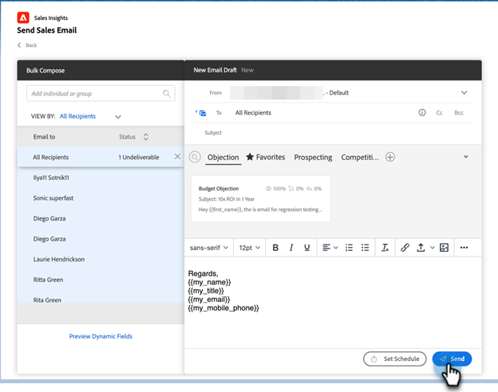

# Utilizzo dell’e-mail per le vendite in blocco in Salesforce {#using-bulk-send-sales-email-in-salesforce}

Scopri come inviare e-mail in blocco in Salesforce per ridimensionare le comunicazioni in uscita utilizzando le azioni di vendita.

>[!NOTE]
>
>Salesforce applica un limite di 200 record che possono essere selezionati contemporaneamente.

>[!PREREQUISITES]
>
>Assicurati di aver installato il [pacchetto Sales Insight più recente](/help/marketo/product-docs/marketo-sales-insight/msi-for-salesforce/upgrading/upgrading-your-msi-package.md){target="_blank"} nella tua istanza Salesforce e di aver configurato i [pulsanti di azione](/help/marketo/product-docs/marketo-sales-insight/actions/crm/salesforce-package-configuration/add-action-buttons-to-salesforce-list-view.md){target="_blank"} nelle visualizzazioni dei contatti e dell&#39;elenco di lead in Salesforce.

## Invio di e-mail in blocco in Salesforce Lightning {#sending-bulk-email-in-salesforce-lightning}

1. In Salesforce, passare alla home page di lead/contatti facendo clic sulla scheda **lead/contatti**.

   

1. Nell’elenco a discesa Visualizza, seleziona la visualizzazione desiderata di Lead/Contatti da inviare tramite e-mail.

   >[!TIP]
   >
   >Per creare una nuova visualizzazione, fai clic sull&#39;icona del baricentro a destra e seleziona **Nuovo**. Dopo aver assegnato alla visualizzazione un nuovo nome e averla salvata, puoi fare clic sull’icona del filtro a destra per passare al set desiderato di lead/contatti da inviare tramite e-mail.

1. Scegliere l&#39;elenco contatti o lead desiderato e fare clic sul pulsante **Invia e-mail vendite**.

   

1. Si passerà alla finestra di composizione Azioni, con le persone selezionate aggiunte.

1. Selezionare il modello da inserire nell&#39;editor della finestra di composizione Azioni o scrivere un messaggio e-mail personalizzato.

   >[!TIP]
   >
   >Utilizza [Categorie bloccate](/help/marketo/product-docs/marketo-sales-insight/actions/email/using-the-compose-window/using-a-template-in-the-compose-window.md#pinning-template-categories-in-the-compose-window){target="_blank"} per fornire un accesso più semplice ai tuoi modelli di e-mail preferiti.

   **PASSAGGIO FACOLTATIVO**: visualizzare in anteprima qualsiasi personalizzazione di campi dinamici facendo clic sul pulsante **Anteprima campi dinamici**.

   >[!TIP]
   >
   >Se desideri personalizzare un modello per tutti i destinatari, facendo clic sull’opzione Tutti i destinatari nella barra laterale Componi in blocco, puoi apportare modifiche a tutte le e-mail dei destinatari contemporaneamente. Se desideri apportare una modifica a un’e-mail specifica, fai clic sul nome o sull’e-mail del destinatario nella barra laterale Componi in blocco. Tieni presente che se apporti modifiche a una singola e-mail e quindi apporti modifiche durante la selezione di Tutti i destinatari, le modifiche apportate a Tutti i destinatari sovrascriveranno quelle apportate alla singola e-mail.

1. Seleziona **Invia** per inviare l&#39;e-mail immediatamente oppure **Imposta pianificazione** per impostare una data e un&#39;ora per l&#39;invio dell&#39;e-mail.

   

## Invio di e-mail in blocco in Salesforce Classic {#sending-bulk-email-in-salesforce-classic}

1. In Salesforce, fai clic sulla scheda **Lead/Contatti**.

1. Nel menu a discesa Visualizza, selezionare la visualizzazione desiderata di Lead/Contatti che si desidera inviare tramite e-mail e fare clic su **Vai**.

   

   >[!TIP]
   >
   >Per creare una nuova visualizzazione, fare clic su Crea nuova visualizzazione e configurare i filtri disponibili per limitare l&#39;elenco delle persone da aggiungere a una campagna di vendita.

1. Scegliere l&#39;elenco contatti o lead desiderato e fare clic sul pulsante **Invia e-mail vendite**.

   

1. Passerete alla finestra di composizione Azioni con i destinatari selezionati nella finestra di composizione.

1. Selezionate il modello da inserire nell&#39;editor della finestra di composizione Azioni o scrivete un messaggio e-mail personalizzato.

   

   >[!TIP]
   >
   >Utilizza [Categorie bloccate](/help/marketo/product-docs/marketo-sales-insight/actions/email/using-the-compose-window/using-a-template-in-the-compose-window.md#pinning-template-categories-in-the-compose-window){target="_blank"} per fornire un accesso più semplice ai tuoi modelli di e-mail preferiti.

   **PASSAGGIO FACOLTATIVO**: visualizzare in anteprima qualsiasi personalizzazione di campi dinamici facendo clic sul pulsante **Anteprima campi dinamici**.

   >[!TIP]
   >
   >Se desideri personalizzare un modello per tutti i destinatari, facendo clic sull’opzione Tutti i destinatari nella barra laterale Componi in blocco, puoi apportare modifiche a tutte le e-mail dei destinatari contemporaneamente. Se desideri apportare una modifica a un’e-mail specifica, fai clic sul nome o sull’e-mail del destinatario nella barra laterale Componi in blocco. Tieni presente che se apporti modifiche a una singola e-mail e quindi apporti modifiche durante la selezione di Tutti i destinatari, le modifiche apportate a Tutti i destinatari sovrascriveranno quelle apportate alla singola e-mail.

1. Seleziona **Invia** per inviare l&#39;e-mail immediatamente oppure **Imposta pianificazione** per impostare una data e un&#39;ora per l&#39;invio dell&#39;e-mail.
