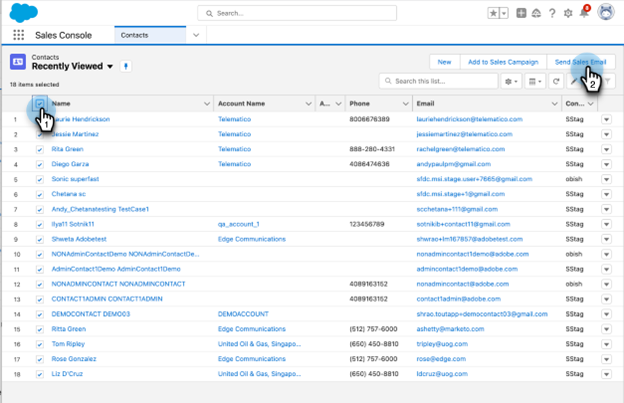

# Utilizzo dell’e-mail per le vendite in blocco in Salesforce {#using-bulk-send-sales-email-in-salesforce}

Scopri come inviare e-mail in blocco in Salesforce per aiutarti a ridimensionare le comunicazioni in uscita utilizzando le azioni di vendita.

>[!NOTE]
>
>Salesforce applica un limite di 200 record che possono essere selezionati contemporaneamente.

>[!PREREQUISITES]
>
>Assicurarsi di aver installato [pacchetto Sales Insight più recente](/help/marketo/product-docs/marketo-sales-insight/msi-for-salesforce/upgrading/upgrading-your-msi-package.md){target="_blank"} to your Salesforce instance and have configured the [Action buttons](/help/marketo/product-docs/marketo-sales-insight/actions/crm/salesforce-package-configuration/add-action-buttons-to-salesforce-list-view.md){target="_blank"} sulle visualizzazioni dei contatti e dell’elenco dei lead in Salesforce.

## Invio di e-mail in blocco in Salesforce Lightning {#sending-bulk-email-in-salesforce-lightning}

1. In Salesforce, accedi alla home page Lead/Contatti facendo clic sul pulsante **Lead/Contatti** scheda.

   

1. Nell’elenco a discesa Visualizza, seleziona la visualizzazione desiderata di Lead/Contatti da inviare tramite e-mail.

   >[!TIP]
   >
   >Per creare una nuova vista, fai clic sull’icona a forma di cono a destra e seleziona **Nuovo**. Dopo aver assegnato alla visualizzazione un nuovo nome e averla salvata, puoi fare clic sull’icona del filtro a destra per passare al set desiderato di lead/contatti da inviare tramite e-mail.

1. Scegliere l&#39;elenco di contatti o lead desiderato e fare clic su **Invia e-mail vendite** pulsante.

   

1. Si passerà alla finestra di composizione Azioni, con le persone selezionate aggiunte.

1. Selezionare il modello da inserire nell&#39;editor della finestra di composizione Azioni o scrivere un messaggio e-mail personalizzato.

   >[!TIP]
   >
   >Utilizzare [Categorie bloccate](/help/marketo/product-docs/marketo-sales-insight/actions/email/using-the-compose-window/using-a-template-in-the-compose-window.md#pinning-template-categories-in-the-compose-window){target="_blank"} per fornire un accesso più semplice ai tuoi modelli e-mail preferiti.

   **PASSAGGIO FACOLTATIVO**: per visualizzare in anteprima tutte le personalizzazioni di Campi dinamici, fai clic sul pulsante **Anteprima campi dinamici** pulsante.

   >[!TIP]
   >
   >Se desideri personalizzare un modello per tutti i destinatari, facendo clic sull’opzione Tutti i destinatari nella barra laterale Componi in blocco, puoi apportare modifiche a tutte le e-mail dei destinatari contemporaneamente. Se desideri apportare una modifica a un’e-mail specifica, fai clic sul nome o sull’e-mail del destinatario nella barra laterale Componi in blocco. Tieni presente che se apporti modifiche a una singola e-mail e quindi apporti modifiche durante la selezione di Tutti i destinatari, le modifiche apportate a Tutti i destinatari sovrascriveranno quelle apportate alla singola e-mail.

1. Seleziona **Invia** per inviare l&#39;e-mail immediatamente, oppure **Imposta pianificazione** per impostare una data e un&#39;ora per l&#39;invio dell&#39;e-mail.

   

## Invio di e-mail in blocco in Salesforce Classic {#sending-bulk-email-in-salesforce-classic}

1. In Salesforce, fai clic su **Lead/Contatti** scheda.

1. Nell’elenco a discesa Visualizza, seleziona la visualizzazione desiderata di Lead/Contatti che desideri inviare tramite e-mail e fai clic su **Vai**.

   

   >[!TIP]
   >
   >Per creare una nuova visualizzazione, fare clic su Crea nuova visualizzazione e configurare i filtri disponibili per limitare l&#39;elenco delle persone da aggiungere a una campagna di vendita.

1. Scegliere l&#39;elenco dei contatti o dei lead desiderati e fare clic su **Invia e-mail vendite** pulsante.

   

1. Passerete alla finestra di composizione Azioni con i destinatari selezionati nella finestra di composizione.

1. Selezionate il modello da inserire nell&#39;editor della finestra di composizione Azioni o scrivete un messaggio e-mail personalizzato.

   

   >[!TIP]
   >
   >Utilizzare [Categorie bloccate](/help/marketo/product-docs/marketo-sales-insight/actions/email/using-the-compose-window/using-a-template-in-the-compose-window.md#pinning-template-categories-in-the-compose-window){target="_blank"} per fornire un accesso più semplice ai tuoi modelli e-mail preferiti.

   **PASSAGGIO FACOLTATIVO**: per visualizzare in anteprima tutte le personalizzazioni di Campi dinamici, fai clic sul pulsante **Anteprima campi dinamici** pulsante.

   >[!TIP]
   >
   >Se desideri personalizzare un modello per tutti i destinatari, facendo clic sull’opzione Tutti i destinatari nella barra laterale Componi in blocco, puoi apportare modifiche a tutte le e-mail dei destinatari contemporaneamente. Se desideri apportare una modifica a un’e-mail specifica, fai clic sul nome o sull’e-mail del destinatario nella barra laterale Componi in blocco. Tieni presente che se apporti modifiche a una singola e-mail e quindi apporti modifiche durante la selezione di Tutti i destinatari, le modifiche apportate a Tutti i destinatari sovrascriveranno quelle apportate alla singola e-mail.

1. Seleziona **Invia** per inviare l&#39;e-mail immediatamente, oppure **Imposta pianificazione** per impostare una data e un&#39;ora per l&#39;invio dell&#39;e-mail.
