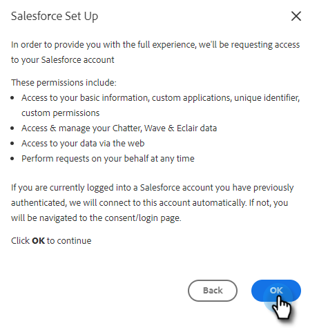

# Connetti il tuo account [!DNL Sales Insight Actions] a [!DNL Salesforce] {#connect-your-sales-insight-actions-account-to-salesforce}

Segui questi semplici passaggi per connettere l&#39;account [!DNL Sales Insight Actions] a [!DNL Salesforce].

## Come connettersi come amministratore {#how-to-connect-as-an-admin}

1. Fare clic sull&#39;icona ingranaggio e selezionare **[!UICONTROL Settings]**.

   

1. In [!UICONTROL Admin Settings], fare clic su **[!UICONTROL Salesforce]**.

   

1. Nella scheda [!UICONTROL Connections & Customizations], fare clic su **[!UICONTROL Salesforce]** e quindi su **[!UICONTROL Connect]**.

   

1. Fai clic su **[!UICONTROL OK]**.

   

1. Se hai già effettuato l’accesso a Salesforce, sarai connesso. In caso contrario, ti verrà chiesto di effettuare l’accesso.

## Come connettersi come non amministratore {#how-to-connect-as-a-non-admin}

1. Fare clic sull&#39;icona ingranaggio e selezionare **[!UICONTROL Settings]**.

   

1. In [!UICONTROL My Account], selezionare **[!UICONTROL Salesforce]**.

1. In [!UICONTROL Connections & Customizations tab], fare clic su **[!UICONTROL Salesforce]** e quindi su **[!UICONTROL Connect]**.

   

1. Fai clic su **[!UICONTROL OK]**.

   

1. Se hai già effettuato l’accesso a Salesforce, sarai connesso. In caso contrario, ti verrà chiesto di effettuare l’accesso.
