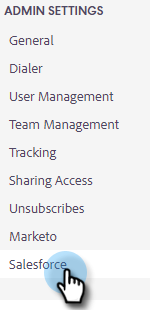

# Disconnetti [!DNL Salesforce] Da [!DNL Sales Insight Actions] {#disconnect-salesforce-from-sales-insight-actions}

A volte potrebbe essere necessario disconnettere l&#39;account [!DNL Salesforce] dall&#39;account [!DNL Sales Insight Actions]. Ecco come.

## Come disconnettersi da [!UICONTROL Salesforce] come amministratore {#how-to-disconnect-from-salesforce-as-an-admin}

1. In [!DNL Sales Insight Actions], fare clic sull&#39;icona ingranaggio in alto a destra e selezionare **[!UICONTROL Settings]**.

   

1. In [!UICONTROL Admin Settings], fare clic su **[!UICONTROL Salesforce]**.

   

1. Nella scheda [!UICONTROL Connections & Customizations], fare clic su **[!UICONTROL Disconnect]**.

   

## Come disconnettersi da [!DNL Salesforce] come non amministratore {#how-to-disconnect-from-salesforce-as-a-non-admin}

1. In [!DNL Sales Insight Actions], fare clic sull&#39;icona ingranaggio in alto a destra e selezionare **[!UICONTROL Settings]**.

   

1. In [!UICONTROL My Account], selezionare **[!UICONTROL Salesforce]**.

PICC

1. Nella scheda [!UICONTROL Connections & Customizations], fare clic su **[!UICONTROL Disconnect]**.

PICC
