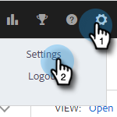
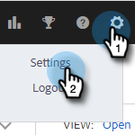

# Scollega Salesforce Dalle Azioni Di Insight Sulle Vendite {#disconnect-salesforce-from-sales-insight-actions}

A volte può essere necessario scollegare il tuo account Salesforce dal tuo account Sales Insight Actions. Ecco come.

## Come disconnettersi da Salesforce come amministratore {#how-to-disconnect-from-salesforce-as-an-admin}

1. In Azioni Approfondimenti vendite, fai clic sull&#39;icona a forma di ingranaggio in alto a destra e seleziona **Impostazioni**.

   

1. In Impostazioni amministratore, fai clic su **Salesforce**.

   

1. Nella scheda Connessioni e personalizzazioni fare clic su **Disconnetti**.

   

## Come disconnettersi da Salesforce come non amministratore {#how-to-disconnect-from-salesforce-as-a-non-admin}

1. In Azioni Approfondimenti vendite, fai clic sull&#39;icona a forma di ingranaggio in alto a destra e seleziona **Impostazioni**.

   

1. In Il mio account, seleziona **Salesforce**.

PICC

1. Nella scheda Connessioni e personalizzazioni fare clic su **Disconnetti**.

PICC
