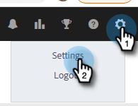
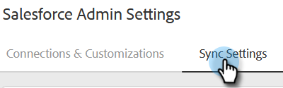
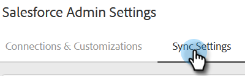

# Impostazioni di sincronizzazione Salesforce {#salesforce-sync-settings}

## Registrazione dell’attività e-mail su Salesforce tramite API {#logging-email-activity-to-salesforce-via-api}

Questa funzionalità richiede l’utilizzo dell’edizione Enterprise/Unlimited di Salesforce o dell’edizione Professional se hai acquistato l’integrazione tramite API di Web Services.

>[!PREREQUISITES]
>
>È necessario collegare le azioni Salesforce e Sales Insight.

1. In Azioni Approfondimenti vendite, fai clic sull’icona a forma di ingranaggio e seleziona **Impostazioni**.

   

1. In Impostazioni amministratore (o &quot;Il mio account&quot; se non sei un amministratore), fai clic su **Salesforce**.

   

1. Fai clic sul pulsante **Impostazioni di sincronizzazione** scheda .

   

1. Fai clic sulla freccia accanto a Registra attività e-mail su Salesforce.

   

1. Fai clic sul pulsante **API Salesforce** scheda . In questa scheda puoi impostare la tua preferenza per la registrazione delle informazioni su Salesforce. Fai clic su **Salva** al termine.

   

## Registrazione dell’attività e-mail a Salesforce tramite e-mail a Salesforce (CCN) {#logging-email-activity-to-salesforce-via-email-to-salesforce-bcc}

Una volta attivato &quot;Email to Salesforce (CCN)&quot;, riceverai un CCN delle tue e-mail di vendita e le tue verranno registrate come attività su opportunità, lead e contatti.

>[!PREREQUISITES]
>
>È necessario collegare le azioni Salesforce e Sales Insight.

**Per registrare le e-mail in Salesforce tramite E-mail (CCN)**

1. In Vendite Marketo, fai clic sull’icona a forma di ingranaggio e seleziona **Impostazioni**.

   

1. In Impostazioni amministratore (o &quot;Il mio account&quot; se non sei un amministratore), fai clic su **Salesforce**.

   

1. Fai clic sul pulsante **Impostazioni di sincronizzazione** scheda .

   

1. Fai clic sul pulsante **E-mail a Salesforce (CCN)** e fai clic su **Attiva**.

   

Se per qualche motivo l&#39;indirizzo Email to Salesforce non effettua il pull in, segui questi passaggi per attivare la funzione CCN nel tuo account Salesforce:

1. Accedi alla tua istanza Salesforce.
1. Trova il nome utente nell’angolo in alto a destra e seleziona la barra a discesa.
1. Seleziona **Impostazioni personali**.
1. Seleziona **E-mail**.
1. Seleziona **E-mail a Salesforce**.
1. In questa pagina verrà visualizzato un campo con l’etichetta &quot;Email to Salesforce Address&quot;. Se accanto a esso non è presente nulla di popolato, scorri verso il basso fino a &quot;I miei indirizzi e-mail accettabili&quot;.
1. Inserisci gli indirizzi e-mail che desideri ricevere da Ccn.
1. Fai clic su **Salva modifiche**.

**Impossibile trovare l&#39;e-mail a Salesforce nelle impostazioni**

Se in Impostazioni non trovi My Email to Salesforce , il tuo amministratore potrebbe non averlo abilitato. Questo può accadere se il tuo team è nuovo di Salesforce o se il tuo team non ha mai utilizzato l’indirizzo CCN fornito da Salesforce.

>[!NOTE]
>
>Per configurarlo, dovrai disporre dei privilegi di amministratore.

1. Fai clic su **Configurazione**.
1. Fai clic su **Amministrazione e-mail**.
1. Fai clic su **Invia e-mail a Salesforce**.
1. Fai clic su **Modifica**.
1. Seleziona la casella accanto a &quot;Attivo&quot;.
1. Fai clic su **Salva**.

## Sincronizza le azioni Approfondimenti vendite Attività/Promemoria alle attività Salesforce {#sync-sales-insight-actions-tasks-reminders-to-salesforce-tasks}

1. In Azioni Approfondimenti vendite, fai clic sull’icona a forma di ingranaggio e seleziona **Impostazioni**.

   

1. In Impostazioni amministratore (o &quot;Il mio account&quot; se non sei un amministratore), fai clic su **Salesforce**.

   

1. Fai clic sul pulsante **Impostazioni di sincronizzazione** scheda .

   

1. Fai clic sulla freccia accanto a Sincronizza attività di vendita/promemoria Marketo in attività Salesforce.

   

1. Scegli l’opzione desiderata (&quot;Non sincronizzare con le attività Salesforce&quot; è selezionata per impostazione predefinita).

   

## Sincronizzazione delle azioni Approfondimenti vendite con Salesforce per la prima volta {#syncing-sales-insight-ations-tasks-with-salesforce-for-the-first-time}

Quando attivi per la prima volta la sincronizzazione tra le azioni Approfondimenti vendite e le attività Salesforce, importiamo le attività Salesforce. Non verranno inviate a Salesforce le attività correnti in Azioni Approfondimenti vendite. Per ridurre l&#39;ingombro e i duplicati, le uniche attività che vengono sincronizzate dalle azioni Insight sulle vendite in Salesforce sono le attività create dopo la sincronizzazione delle azioni Approfondimenti sulle vendite con SFDC.

Ecco cosa succede quando sincronizzi le azioni Approfondimenti vendite e le attività SFDC:

Non appena fai clic su salva nella sincronizzazione delle attività, queste iniziano a sincronizzarsi. Inizialmente ci vorrà un po&#39; di tempo.

Eventuali promemoria aggiornati o creati nelle ultime 24 ore verranno trasferiti dalla DSC alle azioni di Insight sulle vendite. La sincronizzazione è basata sulla data di scadenza e tutte le attività verranno sincronizzate sul back-end, ma in Command Center verranno visualizzate solo le attività scadute oggi e domani.

Se la sincronizzazione è stata attivata in precedenza e si eliminano attività in SFDC, tutto ciò che è stato eliminato negli ultimi 15 giorni verrà eliminato dal Centro comandi.

Sincronizzeremo costantemente le attività tra le azioni Approfondimenti vendite e SFDC, purché la sincronizzazione sia abilitata.

Dopo la sincronizzazione iniziale, tutte le attività create, modificate, completate o eliminate in Azioni Insight vendite verranno sincronizzate nell’elenco delle attività in Salesforce. E qualsiasi cosa creata, modificata, completata o eliminata in Salesforce aggiornerà l’elenco delle attività in Azioni Approfondimenti vendite.

Per attivare questa sincronizzazione, è sufficiente selezionare la casella di sincronizzazione nella pagina Impostazioni nell&#39;applicazione Web.
