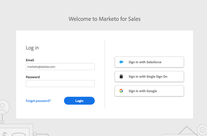

# Impostare una sandbox per le azioni di approfondimento sulle vendite {#set-up-a-sales-insight-actions-sandbox}

>[!NOTE]
>
>Marketo Sales Insight Actions è un&#39;applicazione basata su Web che si integra con l&#39;interfaccia utente di Salesforce tramite [Pacchetto Sales Insight di Marketo](/help/marketo/product-docs/marketo-sales-insight/msi-for-salesforce/installation/install-marketo-sales-insight-package-in-salesforce-appexchange.md){target="_blank"}. A volte viene chiamato &quot;Vendite Marketo&quot; o semplicemente &quot;Azioni&quot;.

Se disponi di una sandbox di Marketo, puoi abilitare un’istanza Azioni da utilizzare con la sandbox a scopo di test.

Quando imposti un’istanza Actions, devi decidere se sarà configurata per l’utilizzo con Salesforce Sandbox o con la produzione Salesforce. Questo perché Salesforce utilizza endpoint diversi per ciascuno di essi e Actions utilizza la connessione a Salesforce per attivare e autenticare gli utenti.

Segui i passaggi indicati di seguito per configurare un’istanza Actions in modo che funzioni con l’istanza Sandbox Salesforce.

>[!NOTE]
>
>Ulteriori informazioni sugli utenti [attivare la propria postazione Azioni](/help/marketo/product-docs/marketo-sales-insight/actions/getting-started/sales-insight-actions-user-onboarding-checklist.md){target="_blank"}. You can also learn about how users will [authenticate with Salesforce](/help/marketo/product-docs/marketo-sales-insight/actions/admin/auto-login-from-salesforce.md){target="_blank"}. Additionally, if you prefer to have users authenticate with email and password, you can learn more about this in our [Login Management settings article](/help/marketo/product-docs/marketo-sales-insight/actions/admin/login-management-settings.md){target="_blank"}.

## Richiedi il provisioning di un’istanza Actions per la tua sandbox Marketo {#request=an-actions-instance}

Le azioni di approfondimento sulle vendite non sono abilitate per le istanze Sandbox di Marketo, a meno che non sia richiesto. Contatta l’Adobe Account Team (il tuo Account Manager) per inviare una richiesta.

## Provisioning dell’account Actions per Marketo Sandbox {#provision-your-actions-account}

Una volta che Actions è abilitato per la tua Sandbox Marketo, dovrai seguire i passaggi seguenti per attivare la nuova istanza.

1. Accedi all’istanza Sandbox di Marketo.

1. Accedi a **Amministratore**.

1. Seleziona **Insight sulle vendite**.

1. Seleziona **Configurazione azioni**.

   >[!IMPORTANT]
   >
   >Un indirizzo e-mail può essere utilizzato solo per un’istanza Actions sia nelle istanze Sandbox che Production. Se sei un amministratore che avrà bisogno di accedere a più istanze in Produzione e Sandbox, devi utilizzare un indirizzo e-mail diverso per ciascuna.

1. Nella scheda di provisioning, seleziona l’utente che desideri invitare all’istanza Azioni approfondimenti vendite.

## Attivare l’istanza delle azioni {#activate-your-actions-instance}

L’istanza Actions dovrà essere attivata con un account di produzione Salesforce. Dopo l’attivazione, può essere impostato su un account Sandbox Salesforce.

1. Individua l’invito inviato.

1. Fai clic su **Introduzione** Link.

1. Attiva con la tua istanza di produzione Salesforce.

1. Segui le istruzioni per configurare l’account. Per una panoramica dettagliata, consulta [Articolo sull’onboarding degli utenti](/help/marketo/product-docs/marketo-sales-insight/actions/getting-started/sales-insight-actions-user-onboarding-guide.md){target="_blank"}.

## Prepara l’istanza delle azioni affinché sia compatibile con l’istanza Sandbox Salesforce {#prepare-your-actions-instance}

Per eseguire le azioni è necessario attivare prima una nuova istanza con un utente di produzione Salesforce. Una volta attivata, puoi utilizzare i seguenti passaggi per preparare l’istanza affinché sia compatibile con Salesforce Sandbox.

1. Aggiorna le impostazioni di accesso in &quot;Tutti i metodi di accesso&quot; in modo da poter accedere con un nome utente e una password, se necessario. Se lo si desidera, è possibile tornare a &quot;Solo Salesforce&quot; dopo aver configurato tutto. [Scopri come eseguire questa operazione qui](/help/marketo/product-docs/marketo-sales-insight/actions/admin/login-management-settings.md){target="_blank"}.

1. Disconnettiti da Salesforce Production e connettiti alla tua Salesforce Sandbox. [Scopri come connetterti qui](/help/marketo/product-docs/marketo-sales-insight/actions/crm/salesforce-integration/connect-your-sales-insight-actions-account-to-salesforce.md){target="_blank"}. Per il passaggio 3, seleziona &quot;Sandbox&quot; invece di &quot;Salesforce&quot;. Se sei già connesso, nella scheda Connessioni e personalizzazioni di Salesforce dovrebbe essere presente un’opzione per disconnetterti.

>[!NOTE]
>
>Se disponi di un dominio personalizzato per l’istanza Salesforce, ti consigliamo di effettuare l’accesso all’istanza Salesforce prima di connetterti a Salesforce o di accedere alle azioni.

## Richiedi la conversione dell’istanza delle azioni per renderla compatibile con la sandbox Salesforce {#request-your-actions-instance-be-converted}

1. Contatto [Supporto Marketo Engage](https://nation.marketo.com/t5/support/ct-p/Support){target="_blank"} per richiedere che la nuova istanza Sales Insight Actions sia configurata per essere compatibile con Salesforce Sandbox.

1. Verifica che tutto sia configurato correttamente tentando di accedere con il pulsante &quot;Accedi con Salesforce&quot; nella pagina toutapp.com/login.

   

   >[!TIP]
   >
   >In caso di problemi, puoi richiedere la reimpostazione della password e utilizzare una password per recuperare l’accesso al tuo account.

Ora la tua istanza è pronta per essere utilizzata con l’istanza Sandbox Salesforce. Se si desidera utilizzare [Accesso automatico Salesforce](/help/marketo/product-docs/marketo-sales-insight/actions/admin/auto-login-from-salesforce.md){target="_blank"} from Salesforce, you can switch back to "Salesforce Only" in your [Login Management settings](/help/marketo/product-docs/marketo-sales-insight/actions/admin/login-management-settings.md){target="_blank"}.

>[!NOTE]
>
>* [Collegare l&#39;account Sales Insight Actions a Salesforce](/help/marketo/product-docs/marketo-sales-insight/actions/crm/salesforce-integration/connect-your-sales-insight-actions-account-to-salesforce.md){target="_blank"}
>* [Guida all’onboarding degli utenti per le azioni di approfondimento sulle vendite](/help/marketo/product-docs/marketo-sales-insight/actions/getting-started/sales-insight-actions-user-onboarding-guide.md){target="_blank"}
>* [Accesso automatico da Salesforce](/help/marketo/product-docs/marketo-sales-insight/actions/admin/auto-login-from-salesforce.md){target="_blank"}
>* [Impostazioni gestione accesso](/help/marketo/product-docs/marketo-sales-insight/actions/admin/login-management-settings.md){target="_blank"}
