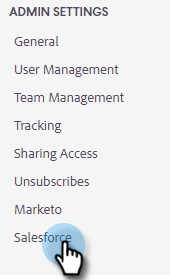
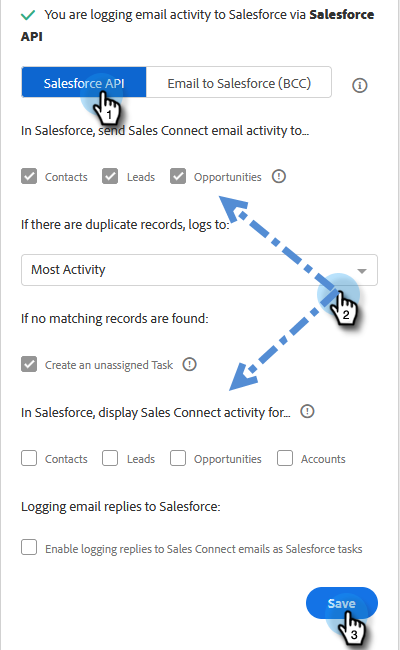
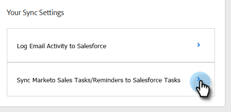

# Sincronizzare attività di vendita con Salesforce {#sync-sales-activities-to-salesforce}

Puoi configurare le impostazioni di sincronizzazione di Actions Salesforce per registrare le attività di e-mail e di chiamata a Salesforce. Questo offre una migliore visibilità ai team che lavorano fuori dal CRM e consente ai manager di utilizzare queste attività per creare rapporti Salesforce personalizzati per monitorare le prestazioni dei team.

## Registrazione dell’attività e-mail in Salesforce tramite API {#logging-email-activity-to-salesforce-via-api}

Questa funzionalità richiede di essere nell’edizione Enterprise/Unlimited di Salesforce o nell’edizione Professional se hai acquistato Integration tramite API di servizi Web.

>[!PREREQUISITES]
>
>Le azioni Salesforce e Sales Insight devono essere collegate.

1. In Azioni Insight vendite, fare clic sull&#39;icona a forma di ingranaggio e selezionare **Impostazioni**.

   

1. In Impostazioni amministratore (o &quot;Il mio account&quot; se non sei un amministratore), fai clic su **Salesforce**.

   

1. Fare clic sulla scheda **Impostazioni sincronizzazione**.

   

1. Fai clic sulla freccia accanto a Registra attività e-mail in Salesforce.

   

1. Fare clic sulla scheda **API Salesforce**. In questa scheda è possibile impostare la propria preferenza per la registrazione delle informazioni in Salesforce. Al termine, fai clic su **Salva**.

   

## Registrazione dell’attività e-mail a Salesforce tramite e-mail a Salesforce (BCC) {#logging-email-activity-to-salesforce-via-email-to-salesforce-bcc}

Dopo aver attivato &quot;E-mail a Salesforce (CCN)&quot;, riceverai un CCN delle e-mail di vendita e le e-mail verranno registrate come attività su opportunità, lead e contatti.

>[!PREREQUISITES]
>
>Le azioni Salesforce e Sales Insight devono essere collegate.

**Per registrare le e-mail in Salesforce tramite e-mail (CCN)**

1. In Marketo Sales, fai clic sull&#39;icona a forma di ingranaggio e seleziona **Impostazioni**.

   

1. In Impostazioni amministratore (o &quot;Il mio account&quot; se non sei un amministratore), fai clic su **Salesforce**.

   

1. Fare clic sulla scheda **Impostazioni sincronizzazione**.

   

1. Fai clic sulla scheda **Invia e-mail a Salesforce (CCN)** e fai clic su **Attiva**.

   

Se per qualche motivo il tuo indirizzo e-mail a Salesforce non viene richiamato, segui questi passaggi per attivare la funzione Ccn nel tuo account Salesforce:

1. Accedi all’istanza di Salesforce.
1. Trova il tuo nome utente nell’angolo in alto a destra e seleziona la barra a discesa.
1. Seleziona **Impostazioni personali**.
1. Seleziona **E-mail**.
1. Selezionare **Posta elettronica personale a Salesforce**.
1. In questa pagina viene visualizzato il campo &quot;Email to Salesforce Address&quot; (Invia e-mail a indirizzo). Se non è presente alcun elemento popolato accanto a esso, scorri verso il basso fino a &quot;I miei indirizzi e-mail accettabili&quot;.
1. Immettere gli indirizzi e-mail che si desidera impostare come CCN.
1. Fai clic su **Salva modifiche**.

**Impossibile trovare il mio indirizzo e-mail a Salesforce nelle mie impostazioni**

Se nelle tue Impostazioni non trovi Il mio indirizzo e-mail a Salesforce, l’amministratore potrebbe non averlo abilitato. Ciò può accadere se il tuo team non ha mai utilizzato Salesforce o il tuo team non ha mai utilizzato l&#39;indirizzo in Ccn fornito da Salesforce.

>[!NOTE]
>
>Per configurare questa impostazione, è necessario disporre dei privilegi di amministratore.

1. Fare clic su **Configurazione**.
1. Fare clic su **Amministrazione e-mail**.
1. Fai clic su **Invia e-mail a Salesforce**.
1. Fai clic su **Modifica**.
1. Seleziona la casella accanto a &quot;Attivo&quot;.
1. Fai clic su **Salva**.

## Sincronizza attività/promemoria azioni Insight vendite con attività Salesforce {#sync-sales-insight-actions-tasks-reminders-to-salesforce-tasks}

1. In Azioni Insight vendite, fare clic sull&#39;icona a forma di ingranaggio e selezionare **Impostazioni**.

   

1. In Impostazioni amministratore (o &quot;Il mio account&quot; se non sei un amministratore), fai clic su **Salesforce**.

   

1. Fare clic sulla scheda **Impostazioni sincronizzazione**.

   

1. Fare clic sulla freccia accanto a Sincronizza attività/promemoria vendite Marketo con attività Salesforce.

   

1. Scegliere l&#39;opzione desiderata (&quot;Non sincronizzare con le attività di Salesforce&quot; è selezionata per impostazione predefinita).

   

## Sincronizzazione delle attività di vendita Insight con Salesforce per la prima volta {#syncing-sales-insight-ations-tasks-with-salesforce-for-the-first-time}

La prima volta che si attiva la sincronizzazione tra le azioni di Sales Insight e le attività di Salesforce, vengono importate le attività di Salesforce. Non trasferiremo a Salesforce le attività correnti che hai nelle Azioni di Insight per le vendite. Per ridurre l&#39;ingombro e i duplicati, le uniche attività che vengono sincronizzate dalle azioni di Sales Insight in Salesforce sono le attività create dopo la sincronizzazione delle azioni di Sales Insight con SFDC.

Ecco cosa accade quando si sincronizzano le azioni Insight di vendita e le attività SFDC:

* Non appena si fa clic su Salva durante la sincronizzazione delle attività, queste vengono sincronizzate. Inizialmente questo richiederà del tempo.

* Tutti i promemoria aggiornati o creati nelle ultime 24 ore verranno inseriti da SFDC alle azioni di Sales Insight. La sincronizzazione è basata sulla data di scadenza e tutte queste attività verranno sincronizzate nel back-end, ma in Centro comandi verranno visualizzate solo le attività in scadenza oggi e domani.

* Se la sincronizzazione è stata attivata in precedenza ed è stata eliminata qualsiasi attività in SFDC, qualsiasi elemento eliminato negli ultimi 15 giorni verrà eliminato da Centro comandi.

* Sincronizzeremo costantemente le attività tra le azioni di Sales Insight e SFDC, purché la sincronizzazione sia abilitata.

* Dopo la sincronizzazione iniziale, tutte le attività create, modificate, completate o eliminate in Azioni Insight vendite verranno sincronizzate con l&#39;elenco delle attività in Salesforce. Inoltre, tutti gli elementi creati, modificati, completati o eliminati in Salesforce aggiorneranno l&#39;elenco delle attività in Azioni Insight vendite.

* Per attivare questa sincronizzazione, seleziona la casella di sincronizzazione nella pagina Impostazioni dell’applicazione web.
