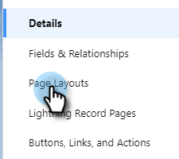
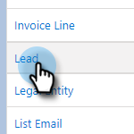

# Disinstalla Marketo Sales Connect da Salesforce Lightning {#uninstall-marketo-sales-connect-from-salesforce-lightning}

Di seguito viene illustrato come disinstallare il pacchetto Marketo Sales Connect dall&#39;account Salesforce dopo aver iniziato a utilizzare le azioni Sales Insight.

## Rimuovi campi Sales Connect dal layout della pagina {#remove-sales-connect-fields-from-page-layout}

1. In Salesforce Lightning, fai clic sull’icona a forma di ingranaggio e seleziona **Configurazione**.

   

1. Clic **Gestione oggetti**.

   

1. Scorri verso il basso fino a e seleziona **Lead**.

   

1. Clic **Layout di pagina**.

   

1. Clic **Layout lead**.

   

   >[!NOTE]
   >
   >La vista di layout Modifica pagina non è ancora stata aggiornata in Salesforce Lightning.

1. Nella console, seleziona **Campi**. In Ricerca rapida, cercare &quot;MSC&quot;. Tutti i campi disattivati sono stati aggiunti al layout della pagina. Dovrai eliminarli.

   

   >[!NOTE]
   >
   >Se nessuno dei campi è disattivato, significa che non sono stati aggiunti al layout di pagina. Puoi saltare questa sezione.

1. Scorri fino alla sezione contenente i campi personalizzati di Sales Connect.

   

1. È possibile aggiungere a questa sezione 10 tipi di campi MSC. Rimuovi tutti i campi aggiunti o elimina semplicemente l’intera sezione.

1. Clic **Salvataggio rapido** al termine.

   

## Rimuovi pulsanti di connessione vendite dai layout di pagina {#remove-sales-connect-buttons-from-page-layouts}

1. Nella console (passaggio 4 sopra), seleziona **Pulsanti**. Cercare &quot;MSC&quot;. Tutti i pulsanti disattivati sono stati aggiunti alla sezione dei pulsanti personalizzati. Dovrai eliminarli.

   

   >[!NOTE]
   >
   >Se nessuno dei pulsanti è disattivato, significa che non sono stati aggiunti. Puoi saltare questa sezione.

1. Trascina e rilascia i pulsanti MSC dalla sezione Pulsanti personalizzati alla console.

   

1. Clic **Salvataggio rapido** al termine.

   

## Rimuovi campi Sales Connect dalla sezione Cronologia attività {#remove-sales-connect-fields-from-activity-history-section}

1. Scorri fino alla parte inferiore della pagina fino alla sezione dell’elenco correlato alla Cronologia attività e fai clic sull’icona a forma di chiave inglese.

   

1. Selezionare i campi Sales Connect nell&#39;area Campi selezionati e fare clic sulla freccia Rimuovi. Clic **OK** al termine.

   

   >[!NOTE]
   >
   >L’abbreviazione MSE _è_ Sales Connect È solo il nome precedente, &quot;Marketo Sales Engage&quot;.

1. Clic **Salva** al termine della pagina Lead.

## Rimuovi pulsanti di azione in blocco Sales Connect dalla vista Elenco lead {#remove-sales-connect-bulk-action-buttons-from-lead-list-view}

1. In Salesforce Lightning, fai clic sull’icona a forma di ingranaggio e seleziona **Configurazione**.

   

1. Clic **Gestione oggetti**.

   

1. Scorri verso il basso fino a e seleziona **Lead**.

   

1. Clic **Cerca layout**.

   

1. Fai clic sulla freccia accanto a Vista a elenco e seleziona **Modifica**.

   

1. Seleziona **Aggiungi a campagna MSC**, **E-mail con MSC**, e **Invia a MSC** e fare clic sulla freccia Rimuovi. Quindi fai clic su **Salva**.

   

I pulsanti non dovrebbero più essere visualizzati nella vista elenco lead.

## Rimuovi configurazione MSC per contatti {#remove-msc-configuration-for-contacts}

1. In Salesforce Lightning, fai clic sull’icona a forma di ingranaggio e seleziona **Configurazione**.

1. Clic **Gestione oggetti**.

1. Scorri verso il basso fino a e seleziona **Contatto**.

1. Clic **Layout di pagina**.

1. Clic **Layout contatto**.

1. Ripeti i passaggi da tutte e tre le sezioni.

## Rimuovi configurazione MSC per opportunità {#remove-msc-configuration-for-opportunity}

1. In Salesforce Lightning, fai clic sull’icona a forma di ingranaggio e seleziona **Configurazione**.

1. Clic **Gestione oggetti**.

1. Scorri verso il basso fino a e seleziona **opportunità**.

1. Clic **Layout di pagina**.

1. Clic **Layout opportunità**.

La visualizzazione dell’opportunità dispone di un solo pulsante: &quot;Invia e-mail MSE&quot; e dei campi seguenti:

## Rimuovi configurazione MSC per l&#39;account {#remove-msc-configuration-for-account}

1. In Salesforce Lightning, fai clic sull’icona a forma di ingranaggio e seleziona **Configurazione**.

1. Clic **Gestione oggetti**.

1. Scorri verso il basso fino a e seleziona **Account**.

1. Clic **Layout di pagina**.

1. Clic **Layout account**.

La visualizzazione Account include un solo pulsante: &quot;Invia e-mail MSE&quot; e i campi seguenti:

## Rimuovi Marketo Sales Outbox {#remove-marketo-sales-outbox}

1. In Salesforce, fai clic su **+** nella parte superiore dello schermo.

1. Clic **Personalizza schede personali**.

1. Selezionare l&#39;opzione Marketo Sales Outbox a destra. Fare clic sulla freccia Rimuovi, quindi su **Salva**.

## Elimina pacchetto Sales Connect {#delete-sales-connect-package}

Dopo aver rimosso tutti gli oggetti dal tuo account Salesforce, segui i passaggi indicati di seguito.

1. In Salesforce Lightning, fai clic sull’icona a forma di ingranaggio e seleziona **Configurazione**.

1. Nella casella Ricerca rapida immettere &quot;Classi apex&quot;.

1. Clic **Elimina** accanto a tutte le voci &quot;MarketoSalesConnectionCustomization&quot; o &quot;MarketoSalesEngageCustomization&quot; dell&#39;elenco.

È tutto pronto!

Di seguito è riportato un elenco di tutti gli oggetti che devono essere rimossi dall’istanza Salesforce:

## Dettagli personalizzazione Sales Connect {#sales-connect-customization-details}

<table>
 <tr>
  <th>Campi attività personalizzati</th>
  <th>Descrizione</th>
  <th>Tipo</th>
  <th>Tipo di dati</th>
 </tr>
 <tr>
  <td>ID presenza locale chiamata MSC</td>
  <td>Come utente, posso scegliere Presenza locale come opzione quando effettuo chiamate dal telefono MSC. Le chiamate in arrivo mostreranno un numero locale per il ricevente</td>
  <td>Attività</td>
  <td>Testo</td>
 </tr>
 <tr>
  <td>URL di registrazione chiamate MSC</td>
  <td>È possibile registrare le chiamate e qui verrà registrato un collegamento per la registrazione </td>
  <td>Attività</td>
  <td>Testo</td>
 </tr>
 <tr>
  <td>Campagna MSC</td>
  <td>Nome del registro della campagna MSC su cui si trova il contatto/lead</td>
  <td>Attività</td>
  <td>Testo</td>
 </tr>
 <tr>
  <td>URL campagna MSC</td>
  <td>Registra l’URL della campagna creata in MSC. Cliccando su questo si aprirà la campagna nell'app web MSC</td>
  <td>Attività</td>
  <td>Testo</td>
 </tr>
 <tr>
  <td>Passaggio corrente della campagna MSC</td>
  <td>Se un contatto/lead fa parte di una campagna, questo campo registra il nome del passaggio in cui si trova</td>
  <td>Attività</td>
  <td>Casella di controllo</td>
 </tr>
 <tr>
  <td>Allegato e-mail MSC visualizzato</td>
  <td>Registra i dati quando un’e-mail viene inviata con un allegato visualizzato dal destinatario</td>
  <td>Attività</td>
  <td>Casella di controllo</td>
 </tr>
 <tr>
  <td>E-mail MSC selezionata</td>
  <td>Registra un segno di spunta quando il destinatario fa clic su un collegamento nell’e-mail</td>
  <td>Attività</td>
  <td>Casella di controllo</td>
 </tr>
 <tr>
  <td>E-mail MSC risposto</td>
  <td>Registra un segno di spunta quando il destinatario risponde all’e-mail</td>
  <td>Attività</td>
  <td>Testo</td>
 </tr>
 <tr>
  <td>Stato e-mail MSC</td>
  <td>Mostra se un’e-mail è inviata/in corso/non recapitata (il tracciamento delle e-mail non recapitate dipende dal canale di consegna utilizzato)</td>
  <td>Attività</td>
  <td>Testo</td>
 </tr>
 <tr>
  <td>Modello e-mail MSC</td>
  <td>Nome del registro del modello MSC utilizzato nell’e-mail inviata al lead/contatto</td>
  <td>Attività</td>
  <td>Testo</td>
 </tr>
 <tr>
  <td>URL modello e-mail MSC</td>
  <td>Registra l’URL del modello creato in MSC. Facendo clic su questa icona si aprirà il modello nell’app Web MSC</td>
  <td>Attività</td>
  <td>Testo</td>
 </tr>
 <tr>
  <td>URL e-mail MSC</td>
  <td>Facendo clic su questo URL si aprirà il centro comandi in MSC e si aprirà la scheda People Detail View history (Visualizzazione dettagli persone) in cui l’utente potrà visualizzare l’e-mail inviata</td>
  <td>Attività</td>
  <td>Testo</td>
 </tr>
 <tr>
  <td>E-mail MSC visualizzata</td>
  <td>Registra un segno di spunta quando il destinatario visualizza un messaggio e-mail</td>
  <td>Attività</td>
  <td>Casella di controllo</td>
 </tr>
</table>

<table>
 <tr>
  <th>Campo di registrazione rollup MSC</th>
  <th>Descrizione</th>
  <th>Tipo</th>
  <th>Tipo di dati</th>
 </tr>
 <tr>
  <td>MSC - Ultimo impegno di marketing</td>
  <td>Ultimo coinvolgimento in arrivo dal marketing</td>
  <td>
  
Account
  
Contatto
  
Lead
  
Opportunità</td>
  <td>Dati e ora</td>
 </tr>
 <tr>
  <td>MSC - Data ultimo accordo di marketing</td>
  <td>Timestamp del coinvolgimento da Marketing</td>
  <td>
  
Account 
  
Contatto 
  
Lead 
  
Opportunità</td>
  <td>Dati e ora</td>
 </tr>
 <tr>
  <td>MSC - Descrizione ultimo coinvolgimento marketing</td>
  <td>Descrizione del progetto</td>
  <td>
  
Account 
  
Contatto 
  
Lead 
  
Opportunità</td>
  <td>Testo</td>
 </tr>
 <tr>
  <td>MSC - Ultima origine del coinvolgimento marketing</td>
  <td>Origine del coinvolgimento marketing</td>
  <td>
  
Account 
  
Contatto 
  
Lead 
  
Opportunità</td>
  <td>Testo</td>
 </tr>
 <tr>
  <td>MSC - Ultimo tipo di coinvolgimento marketing</td>
  <td>Tipo di coinvolgimento (ad esempio, attività Web)</td>
  <td>
  
Account 
  
Contatto 
  
Lead 
  
Opportunità</td>
  <td>Testo</td>
 </tr>
 <tr>
  <td>MSC - Ultima attività per vendite</td>
  <td>Ultima attività in uscita eseguita dal team vendite</td>
  <td>
  
Account 
  
Contatto 
  
Lead 
  
Opportunità</td>
  <td>Dati e ora</td>
 </tr>
 <tr>
  <td>MSC - Ultima risposta</td>
  <td>Ultima risposta e-mail all’e-mail di vendita</td>
  <td>
  
Account 
  
Contatto 
  
Lead 
  
Opportunità</td>
  <td>Dati e ora</td>
 </tr>
 <tr>
  <td>MSC - Campagna di vendita corrente</td>
  <td>Nome del registro della campagna MSC su cui si trova il contatto/lead</td>
  <td>
  
Account 
  
Contatto 
  
Lead 
  
Opportunità</td>
  <td>Testo</td>
 </tr>
 <tr>
  <td>MSC - Ultimo accordo di vendita</td>
  <td>Ultimo impegno in entrata dalle vendite</td>
  <td>
  
Account
  
Contatto
  
Lead
  
Opportunità</td>
  <td>Dati e ora</td>
 </tr>
 <tr>
  <td>MSC - Rinuncia</td>
  <td>Campo di rinuncia</td>
  <td>
  
Account 
  
Contatto 
  
Lead 
  
Opportunità</td>
  <td>Casella di controllo</td>
 </tr>
</table>

<table>
 <tr>
  <th>Pulsanti MSC</th>
  <th>Descrizione</th>
  <th>Tipo</th>
 </tr>
 <tr>
  <td>Invia e-mail MSC</td>
  <td>Invia e-mail di vendita da Salesforce</td>
  <td>
  
Account 
  
Contatto 
  
Lead 
  
Opportunità</td>
 </tr>
 <tr>
  <td>Aggiungi a campagna MSC</td>
  <td>Aggiungi a campagne MSC da Salesforce</td>
  <td>
  
Contatto
  
Lead</td>
 </tr>
 <tr>
  <td>Invia a MSC</td>
  <td>Invia contatto da Salesforce a MSC</td>
  <td>
  
Contatto
  
Lead</td>
 </tr>
 <tr>
  <td>Chiamata con MSC</td>
  <td>Effettuare chiamate di vendita da Salesforce</td>
  <td>
  
Contatto
  
Lead</td>
 </tr>
</table>

<table>
 <tr>
  <th>Pulsanti azione in blocco MSC</th>
  <th>Descrizione</th>
  <th>Tipo</th>
 </tr>
 <tr>
  <td>Aggiungi a campagna MSC</td>
  <td>Aggiungi a campagne MSC da Salesforce</td>
  <td>
  
Contatto
  
Lead</td>
 </tr>
 <tr>
  <td>Invia a MSC</td>
  <td>Invia contatto da Salesforce a MSC</td>
  <td>
  
Contatto
  
Lead</td>
 </tr>
 <tr>
  <td>E-mail con MSC</td>
  <td>E-mail con MSC da Salesforce</td>
  <td>
  
Contatto
  
Lead</td>
 </tr>
</table>
