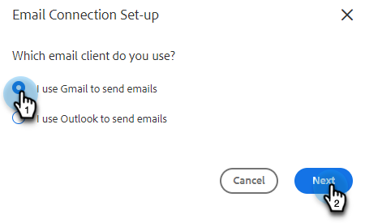

# Connetti a Gmail {#connect-to-gmail}

La connessione a Gmail ti consente di ricevere il tracciamento delle risposte, accedere al canale di consegna Gmail, pianificare le e-mail in Gmail e inviare i messaggi di conformità.

>[!CAUTION]
>
>Se sei [utilizzo dei filtri](https://support.google.com/mail/answer/6579?hl=en#zippy=%2Ccreate-a-filter%2Cedit-or-delete-filters){target="_blank"} o le regole nell’account Gmail per contrassegnare automaticamente le e-mail come lette, ciò può causare problemi con il tracciamento delle risposte. È consigliabile disabilitare le regole che contrassegnano automaticamente le e-mail come lette quando si utilizza il tracciamento delle risposte con Gmail.

1. In Marketo Sales, fai clic sull’icona a forma di ingranaggio e seleziona **Impostazioni**.

   

1. In Il mio account, seleziona **Impostazioni e-mail**.

   

1. Fai clic su **Connessione e-mail** scheda.

   

1. Clic **Introduzione**.

   

1. Seleziona **Utilizzo Gmail per inviare e-mail** e fai clic su **Successivo**.

   

1. Clic **OK**.

   

1. Se hai già effettuato l’accesso a Gmail, scegli l’account a cui desideri connetterti. In caso contrario, immetti il tuo indirizzo Gmail e fai clic su **Successivo**. In questo esempio, non abbiamo ancora effettuato l’accesso.

   

1. Immetti la password e fai clic su **Successivo**.

   

1. Clic **Consenti**.

   

   Puoi utilizzare questa connessione per tenere traccia delle e-mail e anche come canale di consegna.

>[!NOTE]
>
>Gmail applica i propri limiti di invio. [Fai clic qui per ulteriori informazioni](/help/marketo/product-docs/marketo-sales-connect/email/email-delivery/email-connection-throttling.md#email-provider-limits).
