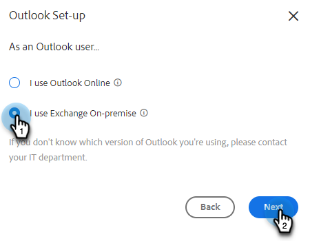

# Connetti a Outlook {#connect-to-outlook}

Scopri come collegare l’account Sales Insight Actions con Outlook.

>[!NOTE]
>
>Ogni utente deve connettersi a Outlook dal proprio account di vendita Marketo.

## Connessione a Outlook Online {#connecting-to-outlook-online}

La connessione a Outlook ti consente di ricevere il tracciamento delle risposte, di accedere al canale di consegna di Outlook, di pianificare le e-mail in Outlook e di inviare messaggi di conformità.

1. In Marketo Sales, fai clic sull’icona a forma di ingranaggio e seleziona **Impostazioni**.

   

1. In Il mio account, seleziona **Impostazioni e-mail**.

   

1. Fai clic su **Connessione e-mail** scheda.

   

1. Clic **Introduzione**.

   

1. Seleziona **Utilizzo Outlook per inviare le e-mail** e fai clic su **Successivo**.

   

1. Selezionare la versione di Outlook in uso e fare clic su **Successivo**. In questo esempio si sta scegliendo Outlook Online.

   

   <table> 
    <tbody>
     <tr>
      <td><strong>Outlook Online</strong></td> 
      <td>Anche noto come Exchange Online</td> 
     </tr>
     <tr>
      <td><strong>Exchange On-Premise</strong></td> 
      <td>Include Exchange 2013 e 2016</td> 
     </tr>
    </tbody>
   </table>

   >[!NOTE]
   >
   >Al momento, Marketo non supporta gli account ibridi di Exchange.

1. Clic **OK**.

   

1. Se non si è connessi a Outlook, immettere le informazioni di accesso e fare clic su **Successivo**. Se lo sei, scegli l’account a cui desideri connetterti e fai clic su **Successivo**. In questo esempio, abbiamo già effettuato l’accesso.

   

1. Clic **Accetta**.

   

   Puoi utilizzare questa connessione per tenere traccia delle e-mail e anche come canale di consegna.

   >[!NOTE]
   >
   >Outlook Online (Office365) applica i propri limiti di invio. [Fai clic qui per ulteriori informazioni](/help/marketo/product-docs/marketo-sales-connect/email/email-delivery/email-connection-throttling.md#email-provider-limits).

## Connessione a Exchange On-Premise {#connecting-to-exchange-on-premise}

La connessione a Exchange On-Premise ti consente di ricevere il tracciamento delle risposte, di accedere al canale di consegna di Outlook, di pianificare le e-mail in Outlook e di inviare messaggi di conformità.

1. In Marketo Sales, fai clic sull’icona a forma di ingranaggio e seleziona **Impostazioni**.

   

1. In Il mio account, seleziona **Impostazioni e-mail**.

   

1. Fai clic su **Connessione e-mail** scheda.

   

1. Clic **Introduzione**.

   

1. Seleziona **Utilizzo Outlook per inviare le e-mail** e fai clic su **Successivo**.

   

1. Selezionare la versione di Outlook in uso e fare clic su **Successivo**. In questo esempio viene scelto Exchange On-Premise.

   

   <table> 
    <tbody>
     <tr>
      <td><strong>Outlook Online</strong></td> 
      <td>Anche noto come Exchange Online</td> 
     </tr>
     <tr>
      <td><strong>Exchange On-Premise</strong></td> 
      <td>Include Exchange 2013 e 2016</td> 
     </tr>
    </tbody>
   </table>

1. Immetti le credenziali e fai clic su **Connetti**.

   

   >[!NOTE]
   >
   >Se si disattiva l&#39;individuazione automatica nel menu a discesa Versione di Exchange, sarà necessario chiedere al reparto IT l&#39;URL di Exchange.

   Puoi utilizzare questa connessione per tenere traccia delle e-mail e anche come canale di consegna.

   >[!NOTE]
   >
   >Quando utilizzi Exchange On-Prem, il team IT stabilirà il limite di invio delle e-mail.

## Ottenimento delle autorizzazioni per la connessione a Outlook Online {#getting-permission-to-connect-to-outlook-online}

È possibile che sia necessario collaborare con il team IT per ottenere l&#39;autorizzazione per consentire a Marketo Sales di connettersi all&#39;account Outlook Online (Microsoft 365).

>[!NOTE]
>
>Informare il team IT che gestisce l&#39;account Microsoft 365 che l&#39;applicazione a cui è necessario accedere è &quot;Marketo Sales Connect&quot;.

A seconda delle preferenze del team IT e della configurazione corrente, è consigliabile consultare il team IT per informazioni su come concedere l&#39;accesso. Di seguito sono riportati alcuni articoli che possono contribuire a guidare la conversazione.

* Consenso globale: [App integrate e Azure AD per amministratori di Microsoft 365](https://learn.microsoft.com/en-us/microsoft-365/enterprise/integrated-apps-and-azure-ads?view=o365-worldwide){target="_blank"}
* Consenso utente: [Configurare il modo in cui gli utenti acconsentono alle applicazioni](https://learn.microsoft.com/en-us/azure/active-directory/manage-apps/configure-user-consent?tabs=azure-portal&amp;pivots=portal){target="_blank"}
* Consenso amministratore: [Configurare il flusso di lavoro di autorizzazione dell’amministratore](https://learn.microsoft.com/en-us/microsoft-365/admin/misc/user-consent?source=recommendations&amp;view=o365-worldwide){target="_blank"}
* Attivazione o disattivazione del consenso utente: [Gestione del consenso degli utenti alle app in Microsoft 365](https://learn.microsoft.com/en-us/microsoft-365/admin/misc/user-consent?source=recommendations&amp;view=o365-worldwide){target="_blank"}
* Gestione con Microsoft Defender: [Gestione delle app OAuth](https://learn.microsoft.com/en-us/defender-cloud-apps/manage-app-permissions){target="_blank"}
