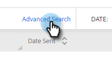

# Panoramica sulla ricerca avanzata {#advanced-search-overview}

Utilizzando la ricerca avanzata per eseguire il targeting dei potenziali clienti che hanno visualizzato, fatto clic o hanno risposto alle e-mail, puoi creare un elenco mirato dei potenziali clienti più coinvolti.

## Come accedere alla ricerca avanzata {#how-to-access-advanced-search}

1. Nell’applicazione web, fai clic su **Centro comandi**.

   

1. Clic **E-mail**.

   

1. Scegli la scheda applicabile.

   

1. Fare clic su Ricerca avanzata.

   

## Filtri {#filters}

**Data**

Scegli l’intervallo di date per la ricerca. Le date predefinite vengono aggiornate in base allo stato dell’e-mail scelto (Inviato, Non consegnato, In sospeso).

**Chi**

Filtra per destinatario/mittente e-mail nella sezione Chi.

<table>
 <tr>
  <td><strong>Elenchi a discesa</strong></td>
  <td><strong>Descrizione</strong></td>
 </tr>
 <tr>
  <td><strong>Visualizza come</strong></td>
  <td>Consente di filtrare in base a un mittente specifico nell'istanza Sales Connect (questa opzione è disponibile solo per gli amministratori).</td>
 </tr>
 <tr>
  <td><strong>Per gruppo</strong></td>
  <td>Filtra le e-mail per un gruppo specifico di destinatari.</td>
 </tr>
 <tr>
  <td><strong>Per persona</strong></td>
  <td>Filtra in base a un destinatario specifico.</td>
 </tr>
</table>

**Quando**

Scegliere in base alla data di creazione, alla data di consegna, alla data non riuscita o alla data pianificata. Le opzioni disponibili variano a seconda dello stato dell’e-mail scelto (Inviato, Non consegnato, In sospeso).

**Campagne**

Filtra le e-mail per partecipazione alla campagna.

**Stato**

Sono disponibili tre stati e-mail tra cui scegliere. Le opzioni di tipo/attività cambiano in base allo stato selezionato.

_**Stato: inviato**_

Filtri per attività e-mail inviata. Puoi scegliere viste/nessuna visualizzazione, clic/nessun clic e/o risposte/nessuna risposta.

_**Stato: In sospeso**_

Filtra per tutte le e-mail in sospeso.

<table>
 <tr>
  <td><strong>Stato</strong></td>
  <td><strong>Descrizione</strong></td>
 </tr>
 <tr>
  <td><strong>Pianificato</strong></td>
  <td>E-mail pianificate dalla finestra di composizione (Salesforce o Web App), da plug-in e-mail o da una campagna.</td>
 </tr>
 <tr>
  <td><strong>Bozze</strong></td>
  <td>E-mail attualmente in stato di bozza. Le e-mail richiedono una riga dell’oggetto e un destinatario per essere salvate come bozza.</td>
 </tr>
 <tr>
  <td><strong>In corso</strong></td>
  <td>E-mail in fase di invio. Le e-mail non devono rimanere in questo stato per più di qualche secondo.</td>
 </tr>
</table>

_**Stato: Non consegnato**_

Filtri per e-mail che non sono mai state consegnate.

<table>
 <tr>
  <td><strong>Stato</strong></td>
  <td><strong>Descrizione</strong></td>
 </tr>
 <tr>
  <td><strong>Operazione non riuscita</strong></td>
  <td>Quando un’e-mail non viene inviata da Sales Connect (i motivi comuni includono: e-mail inviate a contatti annullati/bloccati o se si è verificato un problema durante il popolamento dei campi dinamici).</td>
 </tr>
 <tr>
  <td><strong>Rifiutato</strong></td>
  <td>Un’e-mail viene contrassegnata come non recapitata quando viene rifiutata dal server del destinatario. Qui verranno visualizzate solo le e-mail inviate tramite server Sales Connect.</td>
 </tr>
 <tr>
  <td><strong>Spam</strong></td>
  <td>Quando l’e-mail è stata contrassegnata come spam (termine comune per e-mail non richieste) dal destinatario. Qui verranno visualizzate solo le e-mail inviate tramite server Sales Connect.</td>
 </tr>
</table>

## Ricerche salvate {#saved-searches}

Ecco come creare una ricerca salvata.

1. Dopo aver impostato tutti i filtri, fai clic su **Salva filtri con nome**.

   

1. Assegna un nome alla ricerca e fai clic su **Salva**.

   

Le ricerche salvate si trovano nella barra laterale a sinistra.

