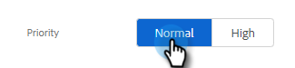

# Assegnazione di attività ai membri del team {#assigning-tasks-to-team-members}

Se desideri collaborare con altri membri del team, l’assegnazione di attività può essere un ottimo modo per coordinare le attività di ricerca di potenziali clienti.

>[!NOTE]
>
>È possibile assegnare solo attività per i contatti condivisi.

1. Nell&#39;applicazione Web fare clic su **[!UICONTROL Command Center]**.

   

1. Fai clic su **[!UICONTROL Add Task]**.

   

1. Selezionare il tipo di attività.

   

1. Assegna un nome all&#39;attività.

   

1. Nel campo Assegna attività selezionare la persona del team a cui si desidera assegnare l&#39;attività.

   

1. Aggiungi la persona a cui desideri rivolgerti nel campo persona.

   

1. Selezionare la data di scadenza.

   

1. Imposta la Priorità.

   

1. Aggiungi tutti i dettagli importanti rilevanti per il tuo compagno di squadra (facoltativo) e fai clic su **[!UICONTROL Create]**.

   
