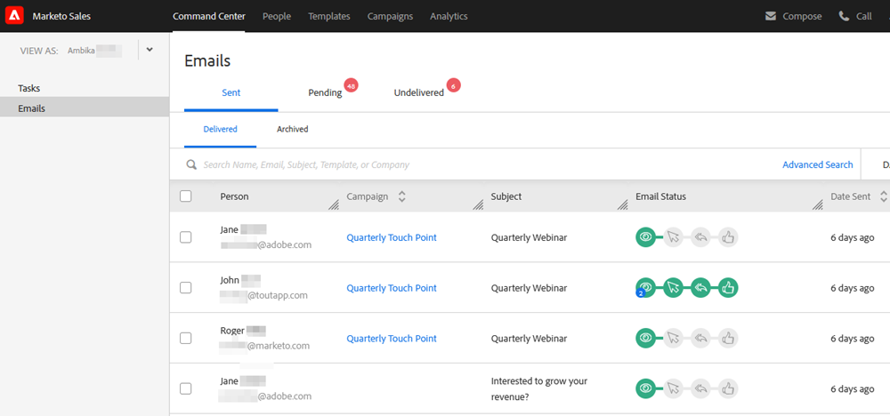

# Panoramica del centro comandi {#command-center-overview}

Il Command Center è una vista unica e unificata che consente di definire il passo successivo, assicurandosi che non vi siano problemi di funzionamento.

## Gestire le e-mail {#manage-emails}

Nella sezione e-mail del centro comandi è possibile gestire tutte le attività e-mail. Consideralo come la tua casella di posta in uscita per esaminare le e-mail inviate da Sales Connect. Gestisci le e-mail pianificate, consulta chi si è occupato delle e-mail, controlla se si sono verificati problemi con la consegna delle e-mail e altro ancora.

La sezione e-mail offre una panoramica di tutte le e-mail e ne semplifica l’organizzazione con schede principali e secondarie che fungono da cartelle in cui le e-mail vengono memorizzate automaticamente in base al loro stato.

<table>
 <tr>
  <th>Principale</th>
  <th>Secondario</th>
  <th>Descrizione</th>
 </tr>
 <tr>
  <th rowspan="2">Inviato</th>
  <td>Consegnato</td>
  <td>E-mail che sono state consegnate al destinatario.</td>
 </tr>
 <tr>
  <td>Archiviato</td>
  <td>E-mail che sono state archiviate dall’utente per disabilitare il tracciamento sulle e-mail.</td>
 </tr>
 <tr>
  <th rowspan="3">In sospeso</th>
  <td>Pianificato</td>
  <td>Messaggi e-mail attualmente pianificati per l’uscita. Una volta inviata, l’e-mail viene spostata nella cartella consegnata.</td>
 </tr>
 <tr>
  <td>Bozza</td>
  <td>E-mail che sono state salvate come bozza. 
  <strong>Nota</strong>: è possibile salvare come bozze solo e-mail singole. Le e-mail in blocco (Seleziona e invia e-mail e Raggruppa e-mail) non verranno salvate come bozze.</td>
 </tr>
 <tr>
  <td>In corso</td>
  <td>Si tratta di uno stato intermedio in cui le e-mail vengono inviate quando sono nel movimento di invio. Le e-mail dovrebbero essere in corso solo per qualche istante.</td>
 </tr>
 <tr>
  <th rowspan="3">Non consegnato</th>
  <td>Operazione non riuscita</td>
  <td>E-mail che non sono state consegnate.
</td>
 </tr>
 <tr>
  <td>Rifiutato</td>
  <td>E-mail rifiutate dal server e-mail dei destinatari. 
  <strong>Nota</strong>: questo viene rilevato solo se sei un utente ToutApp legacy e hai accesso ai server MSC come canale di consegna.</td>
 </tr>
 <tr>
  <td>Spam</td>
  <td>E-mail che sono state contrassegnate manualmente come spam dal destinatario. 
  <strong>Nota</strong>: questo viene rilevato solo se sei un utente ToutApp legacy e hai accesso ai server MSC come canale di consegna.</td>
 </tr>
</table>

## Gestisci le Attività {#manage-tasks}

La sezione delle attività è un punto di riferimento per la gestione e il completamento delle attività. Qui puoi gestire facilmente le tue attività per aumentare la produttività e rimanere concentrato sugli elementi più rilevanti.

## Follow-up con potenziali clienti {#follow-up-with-engaged-prospects}

Dopo aver iniziato a coinvolgere i potenziali clienti tramite la finestra di composizione o le campagne, puoi iniziare a eseguire nuovamente il targeting dei potenziali clienti più coinvolti utilizzando la funzionalità di ricerca avanzata.

Ad esempio, se aggiungi 100 persone a una campagna in MSC, potresti voler eseguire nuovamente il targeting delle persone che hanno visualizzato e fatto clic sulla tua e-mail, ma non vi hanno risposto. A tal fine, puoi utilizzare il filtro Campaign insieme ai filtri di attività Visualizza e Fai clic sullo stato per identificare un elenco di persone da riassegnare.

Bonus: se salvi la ricerca avanzata, questa funzionerà come un elenco dinamico e aggiungerà le e-mail che soddisfano i criteri di coinvolgimento una volta che il destinatario avrà visualizzato o fatto clic sull’e-mail.

>[!MORELIKETHIS]
>
>* Attività
>* Panoramica sulla ricerca avanzata
>* Composizione di e-mail in blocco con Seleziona e invia
