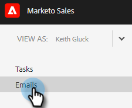

# Colonne e-mail e layout della pagina e-mail {#email-columns-and-email-page-layout}

È possibile configurare le colonne disponibili affinché siano visibili nella sezione e-mail del [Centro comandi](/help/marketo/product-docs/marketo-sales-insight/actions/email/command-center/command-center-overview.md). Le impostazioni di configurazione verranno salvate per ogni sottocartella e-mail (ad esempio Consegnata, Non riuscita, Pianificata, ecc.).

## Colonne e-mail {#email-columns}

<table>
 <colgroup>
  <col>
  <col>
 </colgroup>
 <tbody>
  <tr>
   <th>Colonna</th>
   <th>Descrizione</th>
  </tr>
  <tr>
   <td><strong>[!UICONTROL Person]</td>
   <td>Nome e indirizzo di posta elettronica della persona in [!UICONTROL Sales Connect]. Facendo clic su questo campo si aprirà la scheda Informazioni nella visualizzazione Dettagli persona.</td>
  </tr>
  <tr>
   <td><strong>[!UICONTROL Name]</td>
   <td>Nome della persona in [!UICONTROL Sales Connect].</td>
  </tr>
  <tr>
   <td><strong>[!UICONTROL Address]</td>
   <td>Indirizzo e-mail principale della persona in [!UICONTROL Sales Connect].</td>
  </tr>
  <tr>
   <td><strong>[!UICONTROL Campaign]</td>
   <td>Se l’e-mail è stata inviata come parte di una campagna, verrà visualizzato il nome della campagna. Facendo clic su questo campo si aprirà la pagina di configurazione della campagna.</td>
  </tr>
  <tr>
   <td><strong>[!UICONTROL Template]</td>
   <td>Mostra il nome del modello (se l’e-mail è stata inviata con uno).</td>
  </tr>
  <tr>
   <td><strong>[!UICONTROL Subject]</td>
   <td>Oggetto dell’e-mail.</td>
  </tr>
  <tr>
   <td><strong>[!UICONTROL Groups]</td>
   <td>Mostra i gruppi a cui appartiene il destinatario e-mail.</td>
  </tr>
  <tr>
   <td><strong>[!UICONTROL Job Title]</td>
   <td>Titolo del destinatario e-mail.</td>
  </tr>
  <tr>
   <td><strong>[!UICONTROL Company]</td>
   <td>Società del destinatario dell’e-mail.</td>
  </tr>
  <tr>
   <td><strong>[!UICONTROL Email Status]</td>
   <td>Stato in cui si trova l’e-mail. Gli stati includono: Bozza, Pianificato, In corso, Spam, Rifiutato, Non riuscito, Inviato. Le e-mail inviate mostreranno un flusso di attività che mostra il numero di visualizzazioni, clic e risposte effettuate su quell’e-mail.</td>
  </tr>
  <tr>
   <td><strong>[!UICONTROL Date Created]</td>
   <td>Data di creazione dell’e-mail.</td>
  </tr>
  <tr>
   <td><strong>[!UICONTROL Last Updated]</td>
   <td>Data dell’ultimo aggiornamento dell’e-mail.</td>
  </tr>
  <tr>
   <td><strong>[!UICONTROL Delivery Channel]</td>
   <td>Il nome del canale di consegna utilizzato per inviare l’e-mail.</td>
  </tr>
  <tr>
   <td><strong>[!UICONTROL Latest Activity]</td>
   <td>L’ultimo impegno del destinatario dell’e-mail (ad esempio, visualizza, fai clic o rispondi).</td>
  </tr>
  <tr>
   <td><strong>[!UICONTROL Date Sent]</td>
   <td>La data in cui l’e-mail è stata inviata.</td>
  </tr>
  <tr>
   <td><strong>[!UICONTROL Follow Up Actions]</td>
   <td>Pulsanti di azione rapida che possono essere utilizzati per il completamento tramite e-mail, telefono, inMail o attività.</td>
  </tr>
  <tr>
   <td><strong>[!UICONTROL Group Email]</td>
   <td>Visualizza un segno di spunta se l’e-mail è stata inviata come parte di un’e-mail di gruppo.</td>
  </tr>
  <tr>
   <td><strong>[!UICONTROL Task Due Date]</td>
   <td>Mostra la scadenza delle attività correlate all’e-mail. Le attività possono essere correlate a un’e-mail creando dai pulsanti di azione rapida nell’elenco e-mail.</td>
  </tr>
  <tr>
   <td><strong>[!UICONTROL Email Action]</td>
   <td>Pulsanti di azione rapida che possono essere utilizzati per intervenire sull’e-mail. A seconda dello stato dell’e-mail, possono essere disponibili le seguenti azioni: Archivia, Riuscito, Elimina, Riprova a inviare, Annulla archiviazione.</td>
  </tr>
  <tr>
   <td><strong>[!UICONTROL Task Type]</td>
   <td>Mostra il tipo di attività di un'attività correlata all'e-mail. Le attività possono essere correlate a un’e-mail creando dai pulsanti di azione rapida nell’elenco e-mail.</td>
  </tr>
  <tr>
   <td><strong>[!UICONTROL Date Failed]</td>
   <td>Mostra la data in cui l’e-mail non è riuscita se non è stata consegnata.</td>
  </tr>
 </tbody>
</table>

## Impostazioni layout pagina e-mail {#email-page-layout-settings}

Per configurare il layout, segui la procedura riportata di seguito.

1. Nell&#39;applicazione Web fare clic su **[!UICONTROL Command Center]**.

   

1. Selezionare la sezione **[!UICONTROL Emails]**.

   

1. Fai clic sul pulsante di configurazione. Le opzioni disponibili includono: la scelta del numero di righe desiderate, la selezione dei campi da visualizzare e la selezione della possibilità di raggruppare le e-mail in un singolo elemento della griglia (oppure di visualizzare come singolo elemento tutte le e-mail che fanno parte di una griglia e-mail).

   

1. Al termine, fai clic all’esterno della casella di configurazione per salvare le modifiche.
