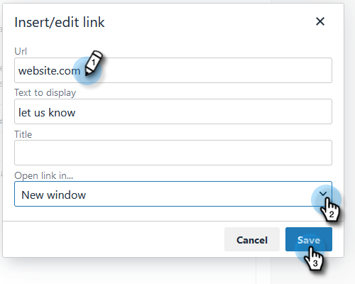

# Personalizzare il messaggio di collegamento per annullare l’iscrizione {#customize-unsubscribe-link-message}

Abbiamo sempre consentito ai team di personalizzare i messaggi di collegamento per l’annullamento dell’abbonamento, ma gli amministratori hanno la possibilità di impostare i messaggi di collegamento per l’annullamento dell’abbonamento per l’intero team al fine di garantire una messaggistica coerente.

>[!NOTE]
>
>Non è possibile utilizzare un collegamento di terze parti per l&#39;annullamento dell&#39;abbonamento con [!DNL Marketo Sales] in quanto queste informazioni non verranno acquisite nel nostro database.

1. Fare clic sull&#39;icona ingranaggio e selezionare **[!UICONTROL Settings]**.

   

1. In [!UICONTROL Admin Settings], fare clic su **[!UICONTROL Unsubscribes]**.

   

1. Determina se questo messaggio sarà il predefinito per l’intero team o se vuoi consentire al team di creare i propri messaggi (in questo esempio, stiamo scegliendo la messaggistica predefinita). Scrivere i messaggi personalizzati nella casella di testo.

   

1. Evidenzia il testo su cui desideri che gli utenti facciano clic per accedere alla pagina di annullamento dell’abbonamento, quindi fai clic sull’icona del collegamento.

   

   >[!NOTE]
   >
   >Non importa quale URL si immette. Quando l’e-mail viene inviata, il primo (o unico) collegamento ipertestuale si collega automaticamente alla pagina predefinita di annullamento dell’iscrizione.

1. Immettere un URL, determinare se si desidera aprire il collegamento nella finestra corrente o in una nuova finestra e fare clic su **[!UICONTROL Save]**.

   

1. Fai clic su **[!UICONTROL Save]** in basso per salvare le modifiche.

   
