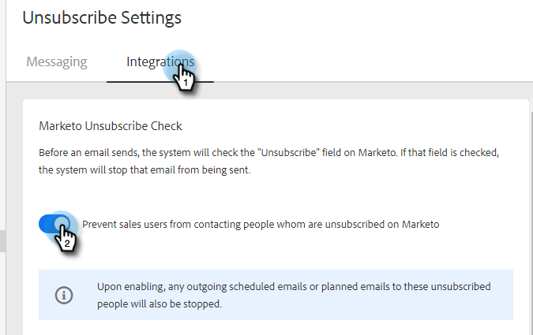

# [!UICONTROL Marketo Unsubscribe Check] {#marketo-unsubscribe-check}

[!UICONTROL Marketo Unsubscribe Check] utilizza la connessione del tuo team a Marketo per impedire che le e-mail arrivino a persone non iscritte al sistema di gestione dei lead di Marketo. Quando un utente di vendita invia un&#39;e-mail con [!DNL Marketo Sales], verrà effettuata una chiamata API a Marketo per verificare se l&#39;ID e-mail non è abbonato. In caso affermativo, l’e-mail non verrà inviata.

>[!NOTE]
>
>**Autorizzazioni amministratore richieste**

## Attivazione {#turning-it-on}

1. Fare clic sull&#39;icona ingranaggio e selezionare **[!UICONTROL Settings]**.

   

1. In [!UICONTROL Admin Settings], fare clic su **[!UICONTROL Unsubscribes]**.

   

1. Fare clic sulla scheda **[!UICONTROL Integrations]**. Nella sezione [!UICONTROL Marketo Unsubscribe Check], fare clic sul dispositivo di scorrimento per attivare il controllo.

   

## Aspetti da considerare {#things-to-know}

Controllo per annullare l’abbonamento a Marketo...

* Non viene conteggiato rispetto ai limiti API
* Richiede la connessione a Marketo
* È un’impostazione globale
* Blocca le e-mail inviate dall&#39;applicazione Web, dai client di posta elettronica e da [!DNL Salesforce]
