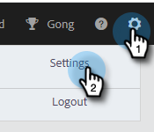

# Controllo dell’annullamento dell’abbonamento a Marketo {#marketo-unsubscribe-check}

Il controllo per l’annullamento dell’abbonamento a Marketo utilizza la connessione del tuo team a Marketo per impedire che le e-mail inviate a persone che non sono abbonate al sistema Marketo Lead Management. Quando un utente di vendita invia un’e-mail con Marketo Sales, viene effettuata una chiamata API a Marketo per verificare se l’ID e-mail è annullato. Se lo è, impediremo l’invio dell’e-mail.

>[!NOTE]
>
>**Autorizzazioni amministratore richieste**

## Attiva {#turning-it-on}

1. Fai clic sull’icona a forma di ingranaggio e seleziona **Impostazioni**.

   

1. In Impostazioni amministratore, fai clic su **Annulla sottoscrizione**.

   

1. Fai clic sul pulsante **Integrazioni** scheda . Nella sezione Controllo annullamento sottoscrizione Marketo , fai clic sul cursore per attivare il controllo.

   

## Cose da sapere {#things-to-know}

Controllo di annullamento sottoscrizione Marketo..

* Non viene conteggiato rispetto ai limiti delle API
* Richiede l&#39;installazione di una connessione Marketo
* È un’impostazione globale
* Blocca le e-mail inviate dall’applicazione web, dai client e-mail e da Salesforce
