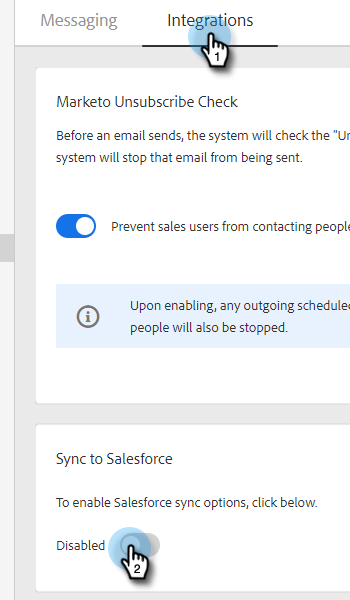

# Sincronizzazione degli annullamenti iscrizione con [!DNL Salesforce] {#syncing-unsubscribes-with-salesforce}

Se desideri sincronizzare gli annullamenti dell’iscrizione con un campo di rinuncia in Salesforce, puoi utilizzare la sincronizzazione degli annullamenti dell’iscrizione di Salesforce.

## Requisiti per l’annullamento dell’abbonamento a Sync to Salesforce {#requirements-for-unsubscribes-to-sync-to-salesforce}

* La sincronizzazione degli annullamenti dell’abbonamento deve essere abilitata (per la sincronizzazione notturna)
* Il campo Opt Out deve essere installato in [!DNL Salesforce]
* I record della persona in [!DNL Marketo Sales] devono avere un ID [!DNL Salesforce]

**Annullamenti iscrizione push**

Quando si raccoglie un annullamento dell&#39;iscrizione in [!DNL Marketo Sales], questo viene inviato a [!DNL Salesforce] in tempo reale e viene aggiornato uno dei campi di rinuncia selezionati per la sincronizzazione. Se hai disattivato la sincronizzazione di [!DNL Salesforce], l&#39;annullamento dell&#39;iscrizione verrà comunque inviato al servizio di rinuncia all&#39;e-mail.

**Sincronizzazione annullamento abbonamento**

Dopo aver attivato la sincronizzazione per l’annullamento dell’iscrizione (passaggio 3 di seguito), la sincronizzazione notturna verrà attivata. La sincronizzazione viene eseguita una volta al giorno intorno alle 20.00 PST. :00 Sincronizzerà in modo bidirezionale tutti gli annullamenti di abbonamenti in Marketo Sales con il campo Opt Out in Salesforce.

>[!NOTE]
>
>La sincronizzazione dell’annullamento dell’abbonamento con Salesforce sincronizzerà gli annullamenti dell’abbonamento, ma non sincronizzerà i nuovi abbonamenti. Se desideri rimuovere un abbonamento a Marketo Sales and Salesforce, deseleziona l’opzione per annullare l’abbonamento in Salesforce e rimuovi l’annullamento dell’abbonamento in Marketo Sales.

## Configura sincronizzazione annullamento sottoscrizioni a [!DNL Salesforce] {#configure-unsubscribe-sync-to-salesforce}

Gli utenti possono decidere se sincronizzare gli annullamenti degli abbonamenti con il campo Opt-out e-mail standard con cui può sincronizzarsi anche Marketo oppure con il campo Opt-out di [!DNL Marketo Sales] in modo da differenziare gli annullamenti degli abbonamenti alle vendite e agli marketing.

1. Fare clic sull&#39;icona ingranaggio e selezionare **[!UICONTROL Settings]**.

   

1. In [!UICONTROL Admin Settings] selezionare **[!UICONTROL Unsubscribes]**.

   

1. Fare clic sulla scheda **[!UICONTROL Integrations]**. In [!UICONTROL Sync to Salesforce] abilitare la sincronizzazione notturna.

   

1. Seleziona il campo a cui desideri sincronizzare.

   

   | Campo | Descrizione |
   |---|---|
   | **Sincronizza con il campo di rinuncia [!DNL Salesforce]** | Selezionata per impostazione predefinita, aggiorna solo il campo di rinuncia [!DNL Salesforce]. |
   | **Sincronizza con il campo di rinuncia [!DNL Marketo Sales]** | Se si desidera separare gli annullamenti degli abbonamenti alle vendite e al marketing, scegliere questa opzione per aggiornare il campo [[!DNL Marketo Sales] Opt Out aggiuntivo.](#msoo) |

## Installazione del campo Rinuncia nel layout di pagina {#installing-the-opt-out-field-in-the-page-layout}

**Rinuncia e-mail**

Rinuncia e-mail è un campo standard in [!DNL Salesforce] disponibile per l&#39;installazione da [!DNL Salesforce]. È necessario essere un amministratore [!DNL Salesforce] per installarlo.

1. Vai a [Salesforce.com](https://salesforce.com) e accedi.

   

1. Fare clic sul proprio nome utente e selezionare **[!UICONTROL Setup]**.

   

1. Nella casella di ricerca rapida cercare Contatto o Lead. In questo caso, il campo verrà installato nel layout della pagina Contatto, ma sarà necessario eseguire l&#39;installazione per entrambi i record persona.

   

1. Seleziona **[!UICONTROL Page Layouts]**.

   

1. Selezionare **[!UICONTROL Edit]** accanto al layout di pagina a cui si desidera aggiungere il campo.

   

1. Seleziona **[!UICONTROL Fields]**.

   

1. Trascina [!UICONTROL Email Opt Out] nel layout della pagina.

   

1. Fai clic su **[!UICONTROL Save]**.

   

## Rinuncia alle vendite Marketo {#marketo-sales-opt-out}

Il campo Rinuncia vendite Marketo è un campo personalizzato disponibile per gli utenti che hanno installato il pacchetto Marketo Sales Insight [da AppExchange](/help/marketo/product-docs/marketo-sales-insight/msi-for-salesforce/installation/install-marketo-sales-insight-package-in-salesforce-appexchange.md){target="_blank"}.

Dopo aver installato correttamente il pacchetto Marketo Sales Insight da AppExchange in Salesforce, visualizzerai il campo Marketo Sales Opt Out disponibile.
