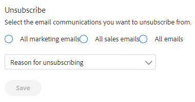

# Panoramica dell’annullamento dell’abbonamento {#unsubscribe-overview}

Sta diventando sempre più importante che le organizzazioni si conformino alle leggi sulla privacy delle e-mail. Per facilitare questa fase, abbiamo apportato alcuni miglioramenti alla nostra esperienza di annullamento dell’abbonamento.

* I collegamenti per l’annullamento dell’abbonamento vengono inseriti in tutte le e-mail inviate da Marketo Sales e Salesforce (non applicabile alle e-mail personalizzate inviate da Outlook o Gmail)
* Gli amministratori possono modificare i messaggi di annullamento dell’abbonamento per l’intero team
* Le informazioni sull&#39;annullamento dell&#39;abbonamento sono memorizzate in PDV
* Gli annullamenti degli abbonamenti possono essere eseguiti manualmente: Clic su Collegamento, Sincronizzazione Salesforce e Rimbalzo
* Nuova pagina di destinazione del collegamento di annullamento dell’abbonamento

## Annulla sottoscrizione pagina di destinazione collegamento {#unsubscribe-link-landing-page}

Quando una persona fa clic sul collegamento per annullare l’abbonamento, viene visualizzata una pagina di destinazione per l’annullamento dell’abbonamento, in cui può selezionare l’elemento da cui si desidera annullare l’abbonamento e il relativo motivo.

Queste informazioni verranno salvate nella visualizzazione dettagli persona per la visualizzazione successiva.

## Annulla sottoscrizione gruppo {#unsubscribe-group}

Visualizza e gestisci tutti i tuoi utenti non abbonati in un’unica posizione.

Utilizza la barra di ricerca per cercare le persone non registrate.

Se sei un amministratore, puoi accedere al gruppo di annullamento dell’abbonamento per filtrare in base agli abbonamenti agli account e visualizzare tutti gli annullamenti di abbonamenti raccolti nel database delle persone.

## Annulla sottoscrizione a scheda della cronologia {#unsubscribe-history-card}

La scheda Cronologia annullamento sottoscrizione consente agli amministratori e agli utenti di ottenere informazioni contestuali sulla cronologia di annullamento dell’abbonamento dei loro contatti. Spostati in questa posizione selezionando una persona nella scheda Persone . Si trova nella parte inferiore della scheda Informazioni nella visualizzazione Dettagli persona.

>[!NOTE]
>
>Sarà presente una scheda Cronologia annullamento sottoscrizione solo se la persona ha _riscritto_ ad un certo punto.

<table> 
 <colgroup> 
  <col> 
  <col> 
 </colgroup> 
 <tbody> 
  <tr> 
   <td><strong>Data</strong></td> 
   <td>
Mostra la data in cui è stato effettuato l’annullamento o il rinnovo dell’abbonamento.
</td> 
  </tr> 
  <tr> 
   <td><strong>Dettagli</strong></td> 
   <td>
Ripristina: Un amministratore di Sales Connect ha rimosso manualmente l'iscrizione dal record del contatto. Può anche mostrare alcuni dettagli relativi al motivo per cui il contatto è stato annullato.

Annulla sottoscrizione: Il contatto è stato annullato.
</td> 
  </tr> 
  <tr> 
   <td><strong>Fonte</strong></td> 
   <td>
Sincronizzazione Salesforce: L’annullamento dell’abbonamento è stato acquisito da una sincronizzazione di Salesforce.

Manuale: L’utente ha fatto clic sul pulsante Annulla sottoscrizione per rinunciare.

Collegamento selezionato: Il destinatario di un’e-mail ha fatto clic sul collegamento per annullare l’abbonamento.

"Nome amministratore": Il nome di un amministratore indica quando l’azione era quella di reintegrare i contatti. Questo consente agli utenti di sapere chi ha rimosso l’iscrizione.
</td> 
  </tr> 
 </tbody> 
</table>

>[!MORELIKETHIS]
>
>[Personalizza messaggio collegamento di annullamento sottoscrizione](/help/marketo/product-docs/marketo-sales-insight/actions/email/unsubscribes/customize-unsubscribe-link-message.md)
