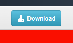

# Aggiungere un allegato o contenuti tracciabili all’e-mail {#add-an-attachment-or-trackable-content-to-your-email}

Quando invii un’e-mail tramite Marketo Sales, puoi aggiungere un file come allegato o creare un collegamento scaricabile (e monitorabile).

>[!NOTE]
>
>In genere, qualsiasi file superiore a 20 MB sarà troppo grande per essere consegnato. La dimensione dell’allegato che puoi inviare tramite e-mail varia a seconda del canale di consegna dell’e-mail in uso.

## Aggiungi un allegato {#add-an-attachment}

1. Crea la bozza dell’e-mail (esistono diversi modi per farlo, in questo esempio stiamo scegliendo **Componi** nell’intestazione).

   

1. Compilare il campo A e immettere un oggetto.

   

1. Fare clic sull&#39;icona dell&#39;allegato.

   

1. Selezionare il file da allegare e fare clic su **Inserisci**.

   

   >[!NOTE]
   >
   >Se devi caricare un file, fai clic sul pulsante **Carica contenuto** in alto a destra nella finestra.

   L’allegato viene visualizzato nella parte inferiore dell’e-mail.

   

## Aggiungi contenuto tracciabile {#add-trackable-content}

1. Crea la bozza dell’e-mail (esistono diversi modi per farlo, in questo esempio scegliamo la finestra Componi ).

   

1. Compilare il campo A e immettere un oggetto.

   

1. Fai clic sul punto dell’e-mail che desideri visualizzare il contenuto tracciabile e fai clic sull’icona dell’allegato.

   

1. Seleziona il contenuto da aggiungere, fai clic sul pulsante **Il contenuto è tracciato** cursore e fai clic su **Inserisci**.

   

   >[!NOTE]
   >
   >Se devi caricare un file, fai clic sul pulsante **Carica contenuto** in alto a destra nella finestra.

   Il contenuto viene visualizzato come collegamento nell’e-mail. Il destinatario può fare clic sul collegamento per scaricare il contenuto.

   

   >[!NOTE]
   >
   >Gli utenti riceveranno una notifica nel feed live quando le persone visualizzano i loro contenuti tracciati. Gli utenti possono inoltre visualizzare il contenuto con le prestazioni più elevate nella sezione del contenuto della pagina Analytics.

## Aggiornamenti dei contenuti tracciabili {#trackable-content-updates}

**Visualizzatore di contenuti tracciabili**

Quando un lead fa clic sul contenuto tracciabile nell’e-mail, apre un visualizzatore di contenuti.

All’interno dei lead dei visualizzatori di contenuti è possibile effettuare le seguenti operazioni.

* Scarica il documento

* Pagina nel documento

* Visualizza le informazioni di contatto del mittente

**Eventi di contenuto tracciabili nel feed live**

Quando un lead clicca sul link del nostro documento, viene visualizzato un evento click. Puoi fare clic sul collegamento per visualizzare il contenuto. Finché hai effettuato l’accesso al tuo account Azioni nel browser, questi clic non verranno conteggiati come eventi.

Ogni volta che il lead avanza verso un’altra pagina del documento, riceverai un evento Visualizzato nel feed live che mostra il nome del documento.
