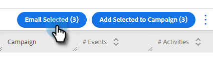

# Composizione di e-mail in blocco con Seleziona e Invia {#composing-bulk-emails-with-select-and-send}

Ecco come inviare/modificare e-mail utilizzando l’opzione Seleziona e invia .

## Invio di e-mail {#sending-emails}

1. Passa alla pagina Persone .

   

1. Seleziona le persone che desideri inviare tramite e-mail.

   

   >[!NOTE]
   >
   >È possibile selezionare un massimo di 200 persone quando si utilizzano le opzioni Seleziona e Invia.

1. Fai clic sul pulsante **E-mail selezionata** pulsante .

   

1. Inserisci un oggetto, seleziona un modello (o componi l’e-mail da zero) e invia/invia[pianificazione](/help/marketo/product-docs/marketo-sales-connect/email/using-the-compose-window/scheduling-an-email.md) l’e-mail.

   

   >[!NOTE]
   >
   >Se hai selezionato un modello e desideri verificare che tutti i campi dinamici si popolino correttamente prima dell’invio, fai clic su **Anteprima campi dinamici**. Assicurati che tutti i destinatari nella barra laterale in blocco siano selezionati per visualizzare l’anteprima di tutte le e-mail. Se selezioni un’e-mail e fai clic su **Anteprima campi dinamici**, verrà visualizzata in anteprima solo l’e-mail.

## Modifica delle e-mail {#editing-emails}

**Modifiche in blocco**

1. Segui i passaggi 1-3 dal [Sezione Invio di e-mail](#sending-emails) sopra.

   >[!NOTE]
   >
   >Per impostazione predefinita, vengono selezionati tutti i destinatari. Se fai clic su un individuo e desideri selezionare di nuovo tutti, fai clic su **Tutti i destinatari**. Come promemoria, tutti i destinatari devono essere selezionati per apportare modifiche in blocco.

1. Apporta le modifiche nell’editor. Puoi creare un nuovo messaggio e-mail o modificare un modello (in questo esempio stiamo creando un nuovo messaggio e-mail).

   

   >[!NOTE]
   >
   >Puoi fare clic su un destinatario e-mail specifico per visualizzare le modifiche propagate a tale e-mail.

1. Fai clic su **Invia** o [Pianificazione](/help/marketo/product-docs/marketo-sales-connect/email/using-the-compose-window/scheduling-an-email.md)) da inviare a tutti i destinatari con gli aggiornamenti e-mail in blocco effettuati.

   

**Modifica ogni e-mail**

Completa gli aggiornamenti in blocco prima di personalizzare ogni e-mail, in quanto un aggiornamento in blocco sovrascrive le modifiche a ogni e-mail nella barra laterale della composizione in blocco.

1. Segui i passaggi 1-4 dal [Sezione Invio di e-mail](#sending-emails).

   >[!NOTE]
   >
   >Per impostazione predefinita, vengono selezionati tutti i destinatari. Se fai clic su un individuo e desideri selezionare di nuovo tutti, fai clic su **Tutti i destinatari**. Come promemoria, tutti i destinatari devono essere selezionati per apportare modifiche in blocco.

1. Seleziona un singolo destinatario.

   

1. Apporta le modifiche nell’editor.

   

   >[!NOTE]
   >
   >È qui che puoi apportare modifiche a un’unica e-mail nella barra laterale principale senza aggiornare il resto delle e-mail.

   >[!TIP]
   >
   >Puoi fare clic su altri destinatari per verificare che le modifiche apportate al destinatario selezionato in precedenza non siano visualizzate.

1. Fai clic su **Invia** o [Pianificazione](/help/marketo/product-docs/marketo-sales-connect/email/using-the-compose-window/scheduling-an-email.md)) da inviare a tutti i destinatari con gli aggiornamenti e-mail in blocco effettuati.

   

   >[!MORELIKETHIS]
   >
   >* [Opzioni di posta elettronica in blocco](/help/marketo/product-docs/marketo-sales-insight/actions/email/using-the-compose-window/bulk-emailing-options.md)
   >* [Utilizzo di un modello nella finestra Componi](/help/marketo/product-docs/marketo-sales-connect/email/using-the-compose-window/using-a-template-in-the-compose-window.md)
   >* [Campi dinamici](/help/marketo/product-docs/marketo-sales-connect/templates/dynamic-fields/how-to-insert-dynamic-fields.md)

