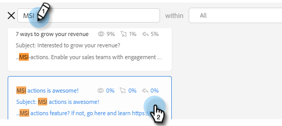

# Utilizzo di un modello nella finestra Componi {#using-a-template-in-the-compose-window}

## Ricerca e utilizzo dei modelli {#finding-and-using-templates}

1. Crea la bozza dell’e-mail (esistono diversi modi per farlo, in questo esempio che stiamo scegliendo **Componi** nell’intestazione).

   

1. Compilare il campo A.

   

1. Fai clic sull’icona di ricerca nella sezione del modello per aprire il campo di ricerca del modello.

   

1. Selezionare una categoria in cui eseguire la ricerca oppure selezionare Tutte per eseguire la ricerca in tutte le categorie.

   

1. Cerca per nome modello, riga oggetto o corpo dell’e-mail. Fai clic sul modello desiderato per selezionarlo.

   

   >[!NOTE]
   >
   >Selezionando un altro modello, tutte le informazioni presenti nell’editor verranno sostituite. Se apporti modifiche, assicurati di copiarle prima di selezionare un altro modello.

## Aggiunta di categorie di modelli nella finestra Componi {#pinning-template-categories-in-the-compose-window}

Preferito **fino a cinque** categorie di modelli specifiche per accedere rapidamente ai modelli più utilizzati.

1. Crea la bozza dell’e-mail (esistono diversi modi per farlo, in questo esempio che stiamo scegliendo **Componi** nell’intestazione).

   

1. Fai clic su **+** accanto a Preferiti.

   

1. Fai clic su **Fissa una categoria** e selezionare la categoria desiderata.

   

   >[!TIP]
   >
   >È consigliabile aggiungere la categoria &quot;Tutti&quot; per accedere rapidamente alla ricerca nell&#39;intera libreria di modelli, in quanto spesso è necessario eseguire ricerche in tutti i modelli per trovare ciò che si sta cercando. Se hai selezionato una categoria bloccata e fai clic sull’icona di ricerca, per impostazione predefinita la ricerca viene eseguita all’interno della categoria bloccata selezionata.

1. Clic **Salva modifiche** al termine (facoltativo: ripetere il passaggio 3 per aggiungerne altri).

   

   >[!TIP]
   >
   >Puoi riorganizzare le categorie bloccate semplicemente trascinandole e rilasciandole prima di salvare le modifiche.

   

   >[!NOTE]
   >
   >**Preferiti** è presente per impostazione predefinita. Contiene i modelli e-mail preferiti, non le categorie.

   La categoria selezionata è bloccata.
