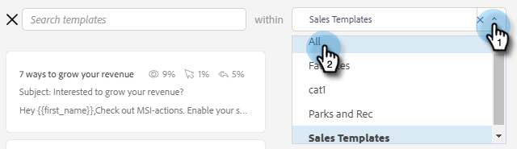

# Utilizzo di un modello nella finestra Componi {#using-a-template-in-the-compose-window}

## Ricerca e utilizzo di modelli {#finding-and-using-templates}

1. Crea la bozza dell’e-mail (esistono diversi modi per farlo, in questo esempio stiamo scegliendo **Componi** nell’intestazione).

   

1. Compilare il campo A.

   

1. Fai clic sull’icona di ricerca nella sezione del modello per aprire il campo di ricerca del modello.

   

1. Selezionare una categoria da cercare (oppure selezionare Tutto per cercare in tutte le categorie).

   

1. Cerca per nome modello, riga oggetto o corpo dell’e-mail. Fai clic sul modello desiderato per selezionarlo.

   

   >[!NOTE]
   >
   >Quando si seleziona un altro modello, vengono sostituite tutte le informazioni attualmente presenti nell’editor. Se apporti modifiche, accertati di copiarle prima di selezionare un altro modello.

## Fissare le categorie di modelli nella finestra Componi {#pinning-template-categories-in-the-compose-window}

Preferito **fino a cinque** categorie di modelli specifiche per accedere rapidamente ai modelli più utilizzati.

1. Crea la bozza dell’e-mail (esistono diversi modi per farlo, in questo esempio stiamo scegliendo **Componi** nell’intestazione).

   

1. Fai clic sul pulsante **+** accanto a Preferiti.

   

1. Fai clic sul pulsante **Fissare una categoria** e seleziona la categoria desiderata.

   

1. Fai clic su **Salva modifiche** al termine (facoltativo: ripetere il passaggio 3 per aggiungere di più).

   

   >[!TIP]
   >
   >È possibile ridisporre le categorie fissate semplicemente trascinandole e rilasciandole prima di salvare le modifiche.

   

   >[!NOTE]
   >
   >**Preferiti** è presente per impostazione predefinita. Contiene i modelli e-mail preferiti, non le categorie.

   La categoria selezionata è ora bloccata.
