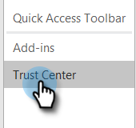

# Come Impedisco Le Visualizzazioni Autonome? {#how-do-i-prevent-self-views}

Ottenere falsi positivi sul tracciamento delle visualizzazioni può portare a incongruenze nel reporting. Questo si verifica spesso quando gli utenti di Marketo Sales richiamano accidentalmente il pixel di tracciamento dal loro client e-mail (lo chiamiamo visualizzazione automatica). Di seguito sono riportati alcuni suggerimenti su ridurre in modo significativo e persino eliminare le visualizzazioni di sé.

## Web (Outlook Web App e Gmail) {#web-outlook-web-app-and-gmail}

Marketo Sales memorizzerà un cookie nel tuo browser per impedire che le visualizzazioni vengano tracciate quando si aprono le e-mail da Outlook Web App e Gmail. Se ricevi ancora visualizzazioni personali, ti consigliamo di effettuare le seguenti operazioni:

* Assicurati che nel computer siano abilitati i cookie.

* Se utilizzi un nuovo computer o dispositivo mobile, assicurati di aver effettuato l’accesso all’applicazione web. Questo ci permetterà di riconoscere il vostro computer/dispositivo in futuro.

## Desktop (Windows) {#desktop-windows}

Le visualizzazioni vengono tracciate scaricando un piccolo pixel immagine invisibile nel client e-mail. È possibile ridurre notevolmente la quantità di visualizzazioni automatiche in Outlook disattivando le immagini da scaricare automaticamente. Di seguito sono riportati i passaggi da seguire.

1. In Outlook, fai clic su **File** nella barra dei menu.

   

1. Fai clic su **Opzioni**.

   

1. Nella finestra di dialogo Opzioni di Outlook fare clic su **Centro protezione**.

   

1. In Centro protezione di Microsoft Outlook fare clic su **Impostazioni del Centro protezione**.

   

1. Fai clic su Scarica automaticamente nel menu a sinistra, quindi seleziona il **Non scaricare automaticamente le immagini nelle e-mail di HTML o negli elementi RSS** casella di controllo.

   

1. Fai clic su **OK** nella finestra di dialogo Centro protezione.

   

1. Fai clic su **OK** nella finestra di dialogo Opzioni di Outlook.

   

## Desktop (Mac) {#desktop-mac}

Le visualizzazioni vengono tracciate scaricando un piccolo pixel immagine invisibile nel client e-mail. È possibile ridurre notevolmente la quantità di visualizzazioni automatiche in Outlook disattivando le immagini da scaricare automaticamente. Di seguito sono riportati i passaggi da seguire.

1. In Outlook, fai clic su **Outlook** nella barra dei menu e seleziona **Preferenze**.

   

1. In E-mail, scegli **Lettura**.

   

1. In Sicurezza, fai clic sul pulsante **Mai** pulsante di scelta.

   
