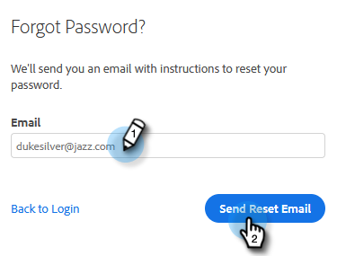

# Modificare la password di vendita di Marketo {#change-your-marketo-sales-password}

Hai bisogno di cambiare la password? Ecco come.

## Modificare La Password Durante L&#39;Accesso {#change-your-password-while-signed-in}

1. Fai clic sull’icona a forma di ingranaggio e seleziona **Impostazioni**.

   

1. Per impostazione predefinita, la pagina Profilo personale viene visualizzata. In Dettagli conto, seleziona la **Cambia password** casella di controllo.

   

1. Immetti la password corrente. Quindi inserisci il tuo nuovo e ridigalo assicurandoti che corrispondano. Fai clic su **Salva** al termine.

   

>[!NOTE]
>
>Le password devono:
>
>* Contenere almeno nove caratteri
>* Usa maiuscole/minuscole miste (sia superiore che inferiore)
>* Includi un numero
>* Includi un carattere speciale

## Modificare la password durante la disconnessione {#change-your-password-while-signed-out}

1. Passa a [Accesso a Sales Connect](https://toutapp.com/login) pagina. Inserisci il tuo indirizzo e-mail e fai clic su **Login**.

   

1. Fai clic su **Password dimenticata**.

   

1. Inserisci l’indirizzo e-mail associato all’account e fai clic su **Invia e-mail di ripristino**.

   

1. Invieremo un&#39;e-mail per verificare che il proprietario dell&#39;account desideri cambiare la password. Fai clic su **Ripristina password**.

   

   >[!NOTE]
   >
   >Assicurati di controllare anche la tua cartella Spam, in quanto questa e-mail a volte può finire lì.

1. Immetti e conferma la nuova password. Fai clic su **Imposta password** al termine.

   
