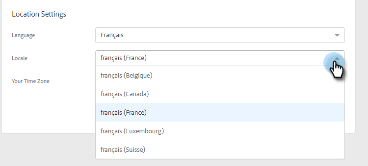

# Gestire il profilo {#manage-your-profile}

Nella pagina Il mio profilo puoi aggiornare il tuo nome, la tua lingua, le impostazioni internazionali e il fuso orario del tuo account e cambiare la tua password.

## Dettagli account {#account-details}

Qui puoi aggiornare il tuo nome e/o la tua password.

1. Fai clic sull’icona a forma di ingranaggio e seleziona **Impostazioni**.

   

1. Per impostazione predefinita, la pagina Profilo personale viene visualizzata. Per aggiornare il nome, è sufficiente digitare le modifiche e fare clic su **Salva**.

   

>[!NOTE]
>
>L’indirizzo e-mail è impostato solo per la visualizzazione. Se hai bisogno di cambiare anche quello, contatta [Supporto Marketo](https://nation.marketo.com/t5/Support/ct-p/Support).

Puoi anche modificare la password in questa sezione. I passaggi sono descritti in questo documento.

## Integrazioni {#your-integrations}

Sul lato destro della pagina, la sezione Integrazioni fornisce lo stato di tutte le connessioni dell’account.

>[!NOTE]
>
>Se utilizzi Exchange On Prem con Marketo Sales, non aggiornerà i controlli di integrità dell’integrazione del canale di consegna (prima riga) o del tracciamento delle risposte (secondo elemento riga). Stiamo lavorando per supportare questo in una versione futura.

## Fuso orario {#time-zone}

Ecco come modificare la lingua, le impostazioni internazionali e/o il fuso orario del tuo account.

>[!NOTE]
>
>Lingue supportate: Inglese, francese, tedesco, giapponese, portoghese, spagnolo.

1. Fai clic sull’icona a forma di ingranaggio e seleziona **Impostazioni**.

   

1. Per modificare la lingua, fai clic sul pulsante **Lingua** a discesa e fai la tua scelta.

   

1. Le impostazioni locali si riferiscono alla regione in cui si parla quella lingua. Una viene scelta per impostazione predefinita quando si modifica la lingua, ma per modificarla manualmente, fai clic sul pulsante **Impostazioni internazionali** a discesa e fai la tua scelta.

   

1. Fai clic sul pulsante **Il tuo fuso orario** a discesa e fai la tua scelta.

   

1. Fai clic su **Salva** al termine.

   

Et voilà!
