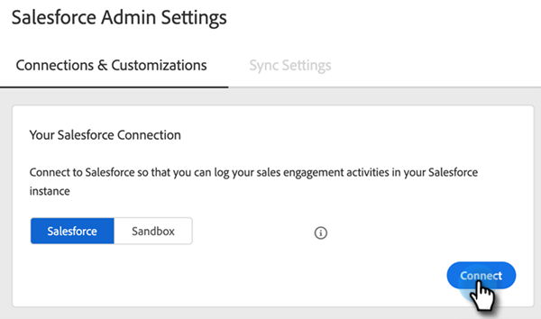
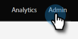

# Guida all’impostazione per l’amministratore di Sales Insight Actions {#sales-insight-actions-admin-setup-guide}

>[!PREREQUISITES]
>
>* Conferma con l&#39;Adobe Account Team (il tuo Account Manager) che le azioni MSI siano state abilitate per l&#39;account di Marketo Engage (se non hai un Account Manager, contatta [Supporto Marketo](https://nation.marketo.com/t5/support/ct-p/Support){target="_blank"}).
>* È necessario configurare la sincronizzazione Marketo/Salesforce.

<table>
 <tr>
  <th>Persona</th>
  <th>Passaggio</th>
 </tr>
 <tr>
  <td>Amministratore Marketo</td>
  <td>Imposta account vendite Marketo</td>
 </tr>
 <tr>
  <td>Amministratore Marketo o  Amministratore Salesforce</td>
  <td>Collegare l'account Marketo Sales a Salesforce</td>
 </tr>
 <tr>
  <td>Amministratore Marketo</td>
  <td>Collegare l'account Marketo Sales a Marketo</td>
 </tr>
 <tr>
  <td>Amministratore Marketo</td>
  <td>Avviare la sincronizzazione dei dati da Marketo all'account di vendita Marketo</td>
 </tr>
 <tr>
  <td>Amministratore Marketo</td>
  <td>Invitare gli utenti su MSI-Actions</td>
 </tr>
 <tr>
  <td>Amministratore Salesforce</td>
  <td>Installa/aggiorna il pacchetto MSI in Salesforce</td>
 </tr>
 <tr>
  <td>Amministratore Salesforce</td>
  <td>Configurare le azioni MSI in Salesforce</td>
 </tr>
</table>

## Imposta account di vendita Marketo {#set-up-marketo-sales-account}

1. In Marketo, fai clic su **Amministratore**.

   

1. Fai clic su **Approfondimenti vendite**, quindi **Configurazione azioni**. Seleziona da un elenco di amministratori Marketo da invitare e fai clic su **Invia invito**.

   

L’utente riceverà un’e-mail con i passaggi per accedere all’account.

>[!NOTE]
>
>Gli utenti aggiuntivi non verranno aggiunti tramite Marketo e verranno aggiunti tramite la pagina Gestione utenti dell&#39;account di vendita . [Fai clic qui](/help/marketo/product-docs/marketo-sales-connect/admin/invite-users.md){target="_blank"} per ulteriori informazioni sull’aggiunta di utenti aggiuntivi.

## Collegare l&#39;account di vendita Marketo a Salesforce {#connect-marketo-sales-account-to-salesforce}

1. Nel tuo account Marketo Sales, fai clic sull&#39;icona a forma di ingranaggio e seleziona **Impostazioni**.

   

1. In Impostazioni amministratore, fai clic su **Salesforce**.

   

1. Nella scheda Connessioni e personalizzazioni fare clic su **Connetti**.

   

1. Fai clic su **OK**.

   

Se hai già effettuato l’accesso a Salesforce, sarai connesso. In caso contrario, ti verrà chiesto di effettuare l&#39;accesso.

## Collega Marketo al tuo account App di vendita {#connect-marketo-to-your-sales-apps-account}

1. Nel tuo account Marketo Sales, fai clic sull&#39;icona a forma di ingranaggio e seleziona **Impostazioni**.

   

1. In Impostazioni amministratore, fai clic su **Marketo**.

   

1. Fai clic su **connect**. Il tuo account verrà quindi connesso.

   

>[!NOTE]
>
>Se non si collega, copia le credenziali dalla scheda &quot;Configurazione azioni&quot; di Marketo Sales Insight e incollale nella scheda Configurazione.

## Avvia sincronizzazione dati {#initiate-data-sync}

La sincronizzazione del campo di unificazione dei dati per le azioni Approfondimenti vendite consente al sistema di estrarre le informazioni personali dal database del Marketo Engage nel database delle azioni Insight vendite, di mantenere i dati delle persone aggiornati e di garantire che le attività siano registrate nei record giusti in Marketo e Salesforce.

>[!CAUTION]
>
>Dopo aver avviato la sincronizzazione dei dati, devi **not** rimuovere l&#39;utente originale dall&#39;istanza di Sales Insight Actions. Questo è l’utente a cui è stato inviato il primo invito.

1. In Marketo, fai clic su **Amministratore**.

   

1. Fai clic su **Approfondimenti vendite**.

   

1. Fai clic sul pulsante **Configurazione azioni** scheda . Nella scheda Sincronizzazione campo azione, fai clic su **Sincronizzazione**.

   

1. Verrà visualizzata un’anteprima dei campi che verranno sincronizzati. Fai clic su **Avvia sincronizzazione**.

   

I record personali esistenti in Marketo e Salesforce verranno sincronizzati nel tuo account App vendite Marketo.

>[!NOTE]
>
>Per saperne di più sulle modalità di sincronizzazione dei dati di persone e attività tra le azioni Approfondimenti vendite, Marketo e Salesforce, [fai clic qui](/help/marketo/product-docs/marketo-sales-insight/actions/admin/actions-data-sync-faq.md){target="_blank"}.

## Invitare singoli utenti alle azioni MSI {#invite-individual-users-to-msi-actions}

1. Nel tuo account Marketo Sales, fai clic sull&#39;icona a forma di ingranaggio e seleziona **Impostazioni**.

   

1. In Impostazioni amministratore, seleziona **Gestione utente**.

   

1. Fai clic su **Azioni** e seleziona **Invitare gli utenti**.

   

1. Inserisci gli indirizzi e-mail e fai clic su **Invito**.

   

>[!NOTE]
>
>Per impostazione predefinita, tutti i nuovi membri verranno aggiunti al team Everyone.

Riceverai un messaggio di conferma.

## Invitare gli utenti tramite CSV nelle azioni MSI {#invite-users-via-csv-to-msi-actions}

1. Nel tuo account Marketo Sales, fai clic sull&#39;icona a forma di ingranaggio e seleziona **Impostazioni**.

   

1. In Impostazioni amministratore, seleziona **Gestione utente**.

   

1. Fai clic su **Azioni** e seleziona **Invitare utenti tramite CSV**.

   

1. Cerca il CSV sul computer, selezionalo e fai clic su **Successivo**.

   

1. Conferma che i campi siano mappati correttamente e fai clic su **Invito**.

   

Riceverai un messaggio di conferma dopo l’invio degli inviti.

>[!NOTE]
>
>Una volta fatto questo, puoi aggiornare il pacchetto MSI esistente o installarne uno nuovo e passare a [configurazione delle azioni MSI in Salesforce](/help/marketo/product-docs/marketo-sales-insight/actions/crm/salesforce-configuration/sales-insight-actions-configuration-in-salesforce.md){target="_blank"}.
