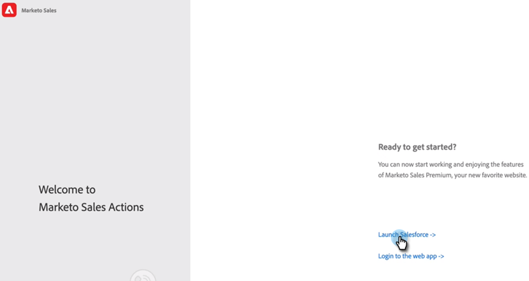

# Guida all’onboarding degli utenti per le azioni di approfondimento sulle vendite {#sales-insight-actions-user-onboarding-guide}

>[!NOTE]
>
>Marketo Sales Insight Actions è un&#39;applicazione basata su Web che si integra con l&#39;interfaccia utente di Salesforce tramite [Pacchetto Sales Insight di Marketo](/help/marketo/product-docs/marketo-sales-insight/msi-for-salesforce/installation/install-marketo-sales-insight-package-in-salesforce-appexchange.md){target="_blank"}. A volte viene chiamato &quot;Vendite Marketo&quot; o semplicemente &quot;Azioni&quot;.

>[!PREREQUISITES]
>
>* Un amministratore deve invitare un utente ad iniziare a utilizzare le azioni MSI.
>* Per attivare il tuo account con Salesforce, devi aver abilitato l’API nelle autorizzazioni del profilo Salesforce.

I nuovi utenti dovranno seguire i passaggi indicati di seguito.

1. Nell’e-mail di benvenuto, fai clic su **Introduzione**.

   

1. Clic **Attiva account con Salesforce**.

   

1. Se hai già effettuato l’accesso al tuo account Salesforce, verrai automaticamente indirizzato alla schermata successiva. Se non hai effettuato l’accesso, effettua l’operazione ora.

   

>[!NOTE]
>
>L’ID e-mail dell’e-mail dell’account di vendita deve essere lo stesso.

1. Clic **Consenti**.

   

1. Clic **Inizio**.

   

1. Clic **Successivo**.

   

1. Scegliere il client di posta elettronica utilizzato (Gmail o Outlook) e fare clic su **Successivo**.

   

1. Inserisci il tuo indirizzo e-mail e fai clic su **Successivo**.

   

1. Immetti la password e fai clic su **Successivo**.

   

1. Clic **Continua**.

   

>[!NOTE]
>
>Se si sceglie Outlook, verrà visualizzata una schermata Autenticazione di Outlook in cui verrà immesso l&#39;indirizzo di posta elettronica.

1. Viene visualizzato il messaggio di completamento della configurazione della connessione e-mail, quindi viene visualizzata la schermata successiva.

   

1. Immetti la firma personalizzata e fai clic su **Salva** (se desideri eseguire questa operazione in un secondo momento tramite la pagina del profilo, fai clic su **Ignora**).

   

1. Clic **Fine**.

   

1. È disponibile l&#39;opzione per visualizzare un&#39;introduzione rapida alle azioni di vendita Marketo. Clic **Successivo** per visualizzare, oppure **Non adesso** per salvare per dopo.

   

1. Al termine della presentazione, o se l’hai saltata, scegli se accedere direttamente all’applicazione web o all’account Salesforce per accedere a tutte le funzioni dal pannello MSI (in questo esempio stiamo scegliendo **Avvia Salesforce**).

   

1. All’interno di Salesforce (Classic o Lightning), puoi passare a qualsiasi lead, contatto, account o opportunità. Tutte le tue azioni di vendita saranno disponibili dal menu a discesa nel pannello MSI.

   
