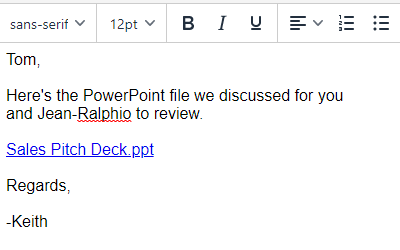

# Integrazione Highspot {#highspot-integration}

Le vendite possono accedere alle funzionalità Highspot da Sales Insight Actions e ottenere maggiore visibilità, efficienza e prestazioni durante l&#39;intero ciclo di vendita. Gli utenti di Sales Insight Action possono selezionare i contenuti di vendita memorizzati sulla piattaforma di supporto alle vendite di Highspot e inserirli direttamente nelle e-mail, nei modelli e nelle campagne di vendita, acquisendo al contempo il tracciamento e l’analisi dei contenuti nelle azioni Highspot e Sales Insight.

## Abilitazione dell’integrazione Highspot {#enabling-highspot-integration}

>[!NOTE]
>
>Per abilitare Highspot per l&#39;istanza delle azioni Sales Insight, è necessario disporre dei privilegi di amministratore.

1. Seleziona impostazioni

PICC

1. Seleziona le impostazioni generali nella barra laterale

PICC

1. Scorri fino alla scheda integrazioni e abilita Highspot

PICC

1. Ora gli utenti visualizzano un’opzione per selezionare Highspot quando si seleziona il pulsante di caricamento del contenuto nella finestra di composizione, nell’editor di modelli e nell’editor e-mail della campagna.

PICC

## Accesso ai contenuti Highspot e condivisione dei contenuti via e-mail {#accessing-highspot-content}

Accedi a Highspot e aggiungi contenuto alle e-mail dalla finestra di composizione Azioni approfondimenti vendite, dall’editor di modelli e dall’editor e-mail della campagna di vendita. Di seguito sono riportati i passaggi per accedere al contenuto dalla finestra di composizione.

1. Crea la bozza dell’e-mail (esistono diversi modi per farlo; in questo esempio selezioniamo **Componi** nell’intestazione).

   

1. Compilare il campo A e immettere un oggetto.

   

1. Scriva il suo messaggio. Fai clic sul punto dell’e-mail in cui desideri inserire il contenuto Highspot. Fai clic sul menu a discesa della freccia (accanto all’icona dell’immagine) e seleziona **Highspot**.

   

1. Accedi al tuo account Highspot.

   

1. Seleziona il contenuto desiderato e fai clic su **Aggiungi contenuto** pulsante.

   

   >[!TIP]
   >
   >Se il contenuto desiderato non viene visualizzato rapidamente, utilizza la barra di ricerca nella parte superiore.

   Il contenuto viene visualizzato come collegamento nell’e-mail. Il destinatario può fare clic sul collegamento per visualizzarlo o scaricarlo.

   

## Tracciamento dei clic sul contenuto Highspot {#tracking-clicks-on-highspot-content}

Quando i destinatari aprono il contenuto inviato, riceverai una notifica nel feed live. L’attività verrà visualizzata con un clic, con i dettagli del collegamento al contenuto. Inoltre, le visualizzazioni sul contenuto e sui download verranno tracciate in Highspot.

