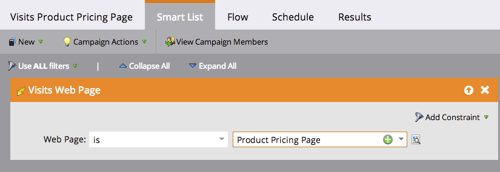

# Momenti interessanti nelle azioni di Insight sulle vendite {#interesting-moments-in-sales-insight-actions}

I momenti interessanti sono la chiave per comunicare con il tuo team di vendita attraverso le azioni Marketo Sales Insight.

## Cos&#39;è un momento interessante? {#what-is-an-interesting-moment}

Sta a te! Decidi quali informazioni sono rilevanti per il tuo team di vendita. Il team di vendita potrebbe voler sapere quando un lead:

* Visita la pagina dei prezzi sul tuo sito web
* Fai clic su un collegamento in un nuovo messaggio e-mail di annuncio del prodotto
* Richiede una demo del prodotto

## Come creo un momento interessante? {#how-do-i-create-an-interesting-moment}

1. Scegli un [campagna intelligente](/help/marketo/product-docs/core-marketo-concepts/smart-campaigns/understanding-smart-campaigns.md){target=&quot;_blank&quot;}, preferibilmente uno che il tuo team di vendita troverebbe interessante se attivato.

   

1. Trascina sopra **Momenti interessanti** passaggio di flusso.

   

1. Seleziona una **type** (E-mail, Milestone o Web).

   

1. Scrivi un messaggio al tuo team di vendita nel **Descrizione** campo che spiega perché questa azione è importante.

   

   >[!NOTE]
   >
   >Marketo aggiungerà anche la data in cui si è verificato e il modo in cui è stato aggiunto il momento interessante (ad es. azione lead > passaggio di flusso, API SOAP).

## Che aspetto ha un momento interessante in Marketo?  {#what-does-an-interesting-moment-look-like-in-marketo}

Momenti interessanti saranno visualizzati in un [registro attività di lead](/help/marketo/product-docs/core-marketo-concepts/smart-lists-and-static-lists/managing-people-in-smart-lists/using-the-person-detail-page.md){target=&quot;_blank&quot;}.

## Che aspetto ha un momento interessante nelle azioni di Sales Insight? {#what-does-an-interesting-moment-look-like-in-sales-insight-actions}

I Momenti Interessanti verranno visualizzati in tempo reale nel feed live di un utente. Utilizziamo l’ID del proprietario principale di Salesforce per mostrare agli utenti i momenti interessanti di lead rilevanti di cui sono proprietari. Gli utenti possono seguire rapidamente i lead tramite e-mail/telefono/campagna di vendita facendo clic sull’elenco a discesa accanto al nome del lead.

