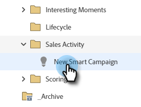

# Attivatori e filtri attività di vendita {#sales-activity-triggers-and-filters}

Se desideri coordinare meglio il tuo coinvolgimento con il team delle vendite o cercare di ottenere una visione migliore del modo in cui interagiscono con i clienti in tutto il percorso di acquirenti, le informazioni sulle attività di vendita in Marketo ti saranno utili.

Segui i passaggi seguenti per scoprire come utilizzare i filtri e i trigger dell’attività di vendita nelle campagne intelligenti.

1. Individua e seleziona la campagna avanzata desiderata.

   

1. In **Elenco avanzato** , cerca &quot;App di vendita&quot;.

   

1. Seleziona e trascina il filtro o il trigger desiderato.

   

1. Selezionate i vincoli desiderati.

   

>[!NOTE]
>
>Per un elenco completo delle attività, dei vincoli e delle definizioni, consulta [Glossario delle attività Analisi vendite](/help/marketo/product-docs/marketo-sales-insight/actions/marketo/sales-insight-actions-activity-glossary.md).
