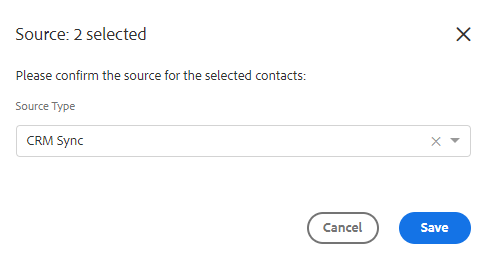

# Azioni in blocco sulle persone {#bulk-actions-on-people}

Per risparmiare tempo, puoi eseguire alcune operazioni in blocco con i tuoi contatti.

Il primo passaggio per tutte le azioni di massa disponibili consiste nel selezionare due o più contatti e fare clic sul punto (tre punti verticali).

## Aggiungi persone al gruppo {#add-people-to-group}

Aggiungere più persone a un gruppo contemporaneamente.

## Origine {#source}

Assegniamo automaticamente un&#39;origine a ogni contatto che entra nel database. Utilizza questo passaggio per aggiornare l’origine.

>[!NOTE]
>
>Le origini non sono personalizzabili.

## Authorization {#authorization}

In conformità con [RGPD](https://eugdpr.org/), utilizza l&#39;autorizzazione per indicare in che modo hai ricevuto l&#39;autorizzazione per interagire con questi contatti.

## Annulla iscrizione {#unsubscribe}

Effettua un annullamento in blocco dell’abbonamento per i contatti che non desiderano più ricevere corrispondenza da te.

